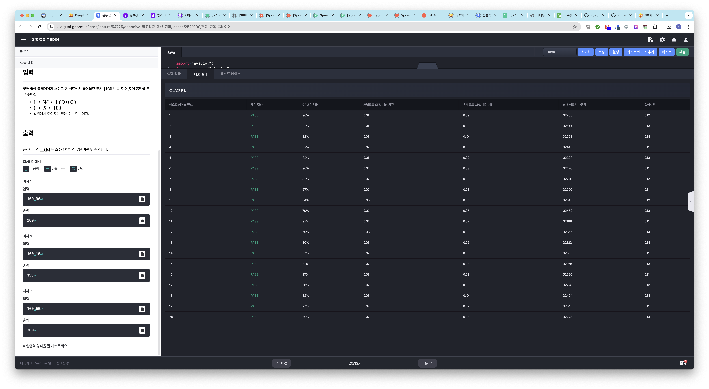
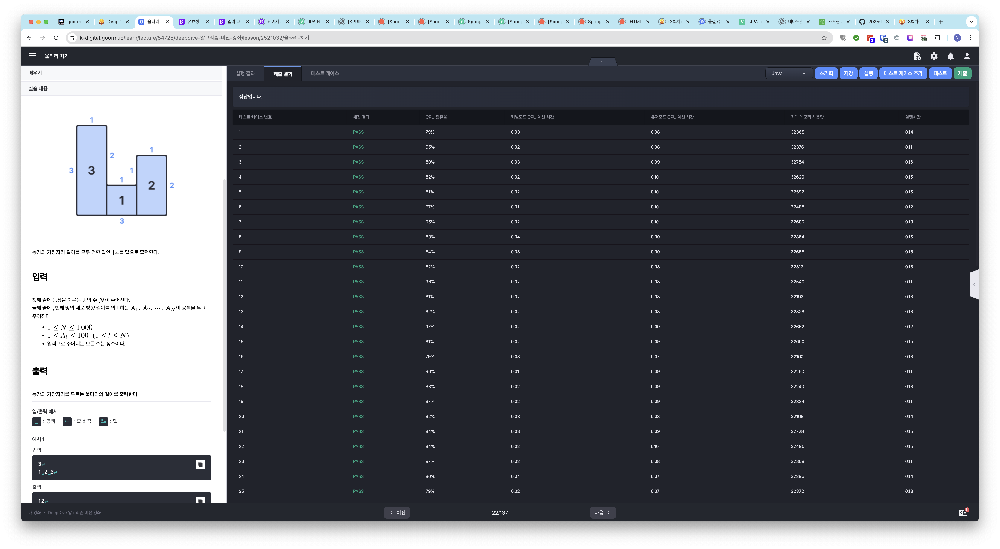
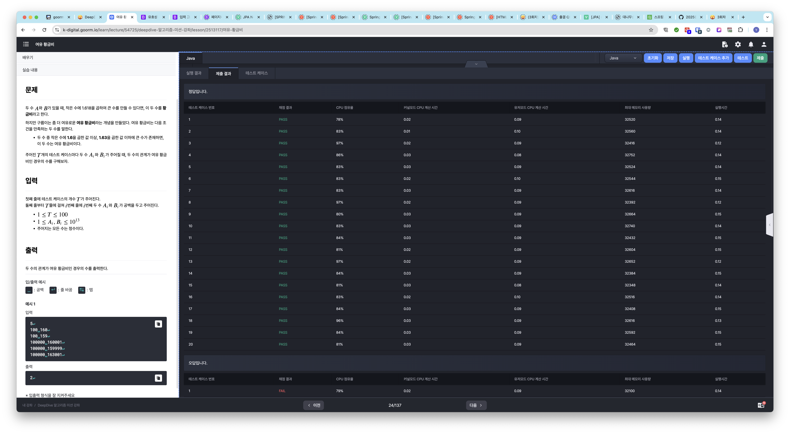

# 알고리즘 미션 - 기초 수학

---

## 운동 중독 플레이어

### 소스코드

```java
import java.io.*;
import java.util.StringTokenizer;
import java.util.Arrays;

class Main {
	public static void main(String[] args) throws Exception {
		int[] input = getInput();
		
		int result = logic(input);
		
		System.out.println(result);
	}
	
	private static int[] getInput() {
		int[] input = new int[2];
		
		try {
			BufferedReader br = new BufferedReader(new InputStreamReader(System.in));
			StringTokenizer st = new StringTokenizer(br.readLine());
			
			input[0] = Integer.parseInt(st.nextToken());
			input[1] = Integer.parseInt(st.nextToken());
		} catch (IOException e) {
			System.out.println(e.getMessage());
		}
		
		return input;
	}
	
	private static int logic(int[] input) {		
		return (int) (input[0] * (1 + input[1] / 30.0));
	}
}
```

### 실행결과



---

## 울타리 치기

### 소스코드

```java
import java.io.*;
import java.util.StringTokenizer;

class Main {
	public static void main(String[] args) throws Exception {
		int[] verticalLength = getInput();
		int result = logic(verticalLength);
		
		System.out.println(result);
	}
	
	private static int[] getInput() {
		int[] verticalLength = null;
		
		try {
			BufferedReader br = new BufferedReader(new InputStreamReader(System.in));
			int fieldSize = Integer.parseInt(br.readLine());
			verticalLength = new int[fieldSize];
			
			StringTokenizer st = new StringTokenizer(br.readLine());
			for (int i = 0; i < fieldSize; i++) {
				verticalLength[i] = Integer.parseInt(st.nextToken());
			}
		} catch (IOException e) {
			System.out.println(e.getMessage());
		}
		
		return verticalLength;
	}
	
	private static int logic(int[] verticalLength) {		
		int horizontalSum = verticalLength.length * 2;
		int verticalSum = 0;
		
		for (int i = 0; i < verticalLength.length; i++) {
      // 땅 길이가 1일 경우
			if (i == 0 && verticalLength.length == 1) {
				verticalSum += verticalLength[i] * 2;
				continue;
			}
			
			if (i == 0) {
				verticalSum += calcFirstField(verticalLength, i);
				continue;
			}
			
			if (i == verticalLength.length - 1) {
				verticalSum += calcLastField(verticalLength, i);
				continue;
			}
			
			verticalSum += calcOtherField(verticalLength, i);
		}
		
		return horizontalSum + verticalSum;
	}
	
	private static int calcFirstField(int[] verticalLength, int idx) {
		int sum = 0;
		
		sum += verticalLength[idx];
		int rightSideLength = verticalLength[idx] - verticalLength[idx + 1];
		if (rightSideLength > 0) {
			sum += rightSideLength;
		}
		
		return sum;
	}
	
	private static int calcLastField(int[] verticalLength, int idx) {
		int sum = 0;
		
		sum += verticalLength[idx];
		int leftSideLength = verticalLength[idx] - verticalLength[idx - 1];
		if (leftSideLength > 0) {
			sum += leftSideLength;
		}
		
		return sum;
	}
	
	private static int calcOtherField(int[] verticalLength, int idx) {
		int sum = 0;
		
		int leftSideLength = verticalLength[idx] - verticalLength[idx - 1];
		if (leftSideLength > 0) {
			sum += leftSideLength;
		}
			
		int rightSideLength = verticalLength[idx] - verticalLength[idx + 1];
		if (rightSideLength > 0) {
			sum += rightSideLength;
		}
		
		return sum;
	}
}
```

### 실행결과



---

## 여유 황금비

### 소스코드

```java
import java.io.*;
import java.util.StringTokenizer;

class Main {
	public static void main(String[] args) throws Exception {
		BufferedReader br = new BufferedReader(new InputStreamReader(System.in));
		StringTokenizer st;
		
		// 테스트 케이스 개수
		int T = Integer.parseInt(br.readLine());
		long[][] data = new long[T][2];
		
		// 입력받은 데이터로 2차원 배열 생성
		for (int i = 0; i < T; i++) {
			st = new StringTokenizer(br.readLine());
			
			data[i][0] = Long.parseLong(st.nextToken());
			data[i][1] = Long.parseLong(st.nextToken());
		}

		
		int count = 0;
		
		for (long[] item : data) {
			if (item[0] < item[1]) {
				if (item[0] * 1.6 <= item[1] && item[1] <= item[0] * 1.63) {
					count++;
				}
				continue;
			}
			
			if (item[1] * 1.6 <= item[0] && item[0] <= item[1] * 1.63) {
				count++;
			}
		}
		
		System.out.println(count);
	}
}
```

###  소스코드 - 시간복잡도 증가 발생 가능성 개선

```java
import java.io.*;
import java.util.StringTokenizer;
import java.util.Arrays;

class Main {
	public static void main(String[] args) throws Exception {
		BufferedReader br = new BufferedReader(new InputStreamReader(System.in));
		StringTokenizer st;

		int T = Integer.parseInt(br.readLine());
		int count = 0;
		
		for (int i = 0; i < T; i++) {
			long[] inputs = Arrays.stream(br.readLine().split(" ")).mapToLong(Long::parseLong).toArray();
			long A = inputs[0]; long B = inputs[1];
			
			if (A < B) {
				if (A * 1.6 <= B && B <= A * 1.63) count++;
				continue;
			}
			if (B * 1.6 <= A && A <= B * 1.63) count++;
		}
		
		System.out.println(count);
	}
}
```

### 실행결과

