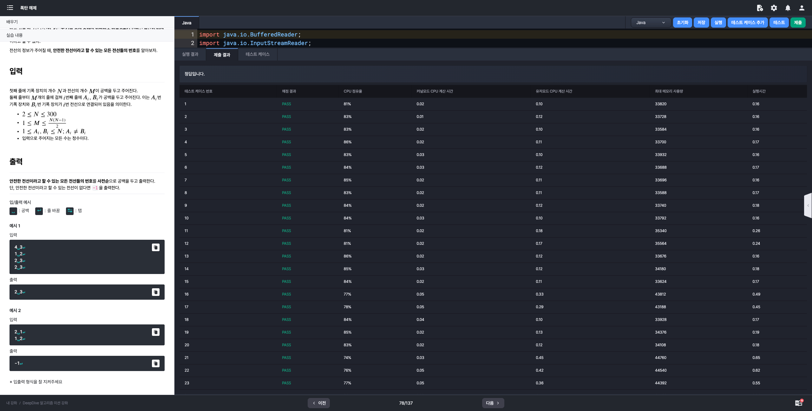
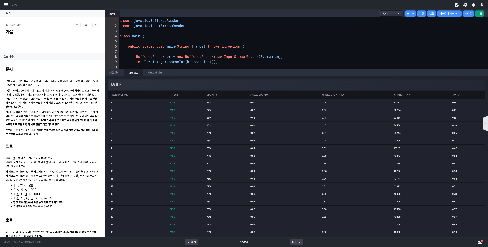

# 알고리즘 미션 - 그래프 이론

---

## 폭탄 해체

### 태그

그래프

### 풀이

- **문제 분석**
  - 폭탄은 $N$개의 기폭 장치와 서로 다른 두 기폭 장치를 잇는 $M$개의 전선으로 이루어져 있다.
    - 기폭 장치마다 1번부터 $N$번까지 차례대로 번호가 부여되어 있다.
    - 전선도 마찬가지로 1번부터 $M$번까지 차례대로 번호가 부여되어 있다.
  - $i$번 기폭 장치가 전선으로 하나 이상의 기폭 장치와 연결되어 있다면 그 기폭 장치는 **활성화**되었다고 한다.
    - 반대의 경우는 **비활성화**되었다고 한다.
  - 구름이는 폭탄 해체를 위해 전선을 끊을 것이다.
    - 끊은 전선의 번호를 $i$라고 했을 때, $i$번 전선이 잇는 두 기폭 장치 중에서 하나라도 비활성화가 된다면 폭탄이 터져버린다.
    - $i$번 전선을 우선 끊어봤는데 폭탄이 터지지 않았다면, $i$번 전선은 안전한 전선이라고 할 수 있다.
  - 분석하자면 특정 간선(전선)을 그래프에서 제거했다고 가정할 때 간선으로 연결된 두 노드(기폭장치)의 차수가 2이상이라면 해당 전선은 안전한 전선이다.
- **입력**
  - [Line] 1: 기폭 장치의 개수 $N$과 전선의 개수 $M$
  - [Line] 2 ~ 2 + M: $A$, $B$ (두 기폭장치가 서로 연결되어 있음을 의미)
  - 제약조건
    - $2 \le N \le 300$
    - $1 \le M \le \frac{N(N-1)}{2}$
    - $1 \le A_{i}, B_{i} \le N;~A_{i} \ne B_{i}$
- **출력**
  - 안전한 전선이라고 할 수 있는 모든 전선들의 번호를 사전순으로 공백을 두고 출력
  - 단, 안전한 전선이 없다면 `-1`을 출력

### 소스코드

```java
import java.io.BufferedReader;
import java.io.InputStreamReader;
import java.util.Arrays;

class Main {

    public static void main(String[] args) throws Exception {

        BufferedReader br = new BufferedReader(new InputStreamReader(System.in));
        int[] input = Arrays.stream(br.readLine().split(" ")).mapToInt(Integer::parseInt).toArray();
        int N = input[0], M = input[1];

        int[] vertex = new int[N];  // 정점의 차수 정보 배열
        Edge[] edges = new Edge[M]; // 간선 정보 배열
        for (int i = 0; i < M; i++) {
            input = Arrays.stream(br.readLine().split(" ")).mapToInt(Integer::parseInt).toArray();
            int A = input[0] - 1, B = input[1] - 1;
            edges[i] = new Edge(A, B);
            vertex[A]++;
            vertex[B]++;
        }

        StringBuilder sb = new StringBuilder();
        for (int i = 0; i < M; i++) {
            Edge edge = edges[i];
            if (vertex[edge.A] == 1 || vertex[edge.B] == 1) {
                continue;
            }
            sb.append(i + 1).append(" ");
        }

        String result = sb.toString().trim();
        if (result.isEmpty()) {
            System.out.println(-1);
        } else {
            System.out.println(result);
        }
    }

    private static class Edge {
        int A;
        int B;

        public Edge(int a, int b) {
            A = a;
            B = b;
        }
    }
}
```

### 실행결과



---

## 가뭄

### 태그

그래프, 트리

### 풀이

- **문제 분석 **

  - 문제의 설명은 길지만 간단히 요약하자면 입력으로 주어진 노드들이 트리를 구성하기 위한 최소 간선의 개수를 구하는 문제이다.
  - 따라서 사실상 주어진 입력 중 수로의 개수 $M$만 필요하고 나머지 값들은 필요하지 않다.

- **입력 (모두 정수)**

  - 테스트 케이스 개수 $T$

    $1 \le T \le 100$

  - 테스트 케이스 정보

    - 지점의 개수 $N$, 수로의 개수 $M$

      $2 \le N \le 1,000,~1 \le M \le 10,000$

    - $A_{i},~B_{i}$ ($M$번 반복)

      $1 \le A_{i},B_{i} \le N; ~~ A_{i} \ne B_{i}$

  - 항상 모든 지점은 수로를 통해 연결되어 있다. (그래프의 사이클은 1개)

- **출력**

  - 테스크 케이스 마다 **정비된 수로만으로 모든 지점이 서로 연결되게끔 정비해야 하는 수로의 최소 개수**를 한 줄에 하나씩 출력

### 소스코드

```java
import java.io.BufferedReader;
import java.io.InputStreamReader;

class Main {

    public static void main(String[] args) throws Exception {

        BufferedReader br = new BufferedReader(new InputStreamReader(System.in));
        int T = Integer.parseInt(br.readLine());

        for (int i = 0; i < T; i++) {
            String[] input = br.readLine().split(" ");
            // 지점의 개수 N, 수로의 개수 M
            int N = Integer.parseInt(input[0]), M = Integer.parseInt(input[1]);
            for (int j = 0; j < M; j++) {
                input = br.readLine().split(" ");
            }
            System.out.println(N - 1);
        }
    }
}
```

### 실행결과



---

## 연합

### 태그


### 풀이

- **문제 분석**
- **입력**
- **출력**

### 소스코드

```java

```

### 실행결과

