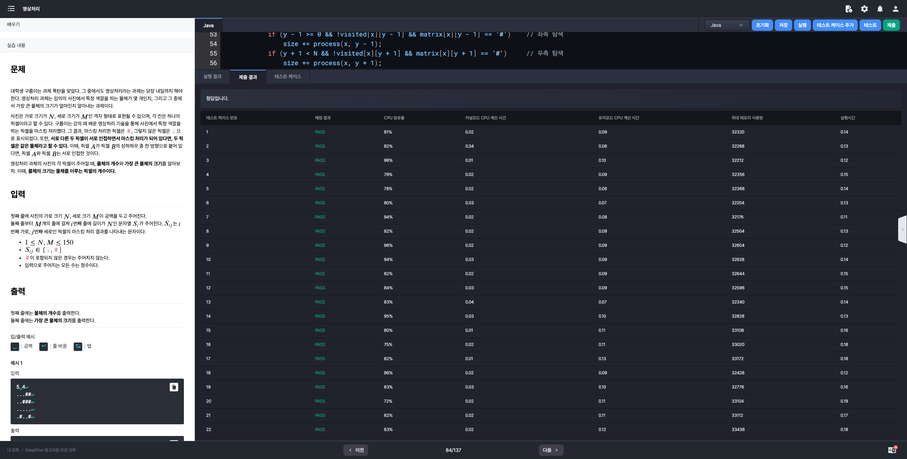

# 알고리즘 미션 - 그래프 탐색

---

## 영상처리

### 태그

그래프, BFS

### 풀이

- **문제 분석**

  - N X M 의 해상도를 가진 영상이 존재
  - 영상에서 마스킹 처리된 픽셀은 `#`, 그렇지 않은 픽셀은 `.`으로 표시됨.
  - 서로 다른 두 픽셀이 인접하면서 마스킹 처리가 되어 있다면, 두 픽셀은 같은 물체를 표현하는 픽셀이다.
  - 2차원 공간을 그래프 탐색 알고리즘(DFS, BFS)로 탐색하여 물체의 개수와 크기를 계산하면 된다.

- **입력**

  - 사진의 가로 크기 $N$, 세로 크기 $M$
  - 영상 데이터

    길이 $N$의 문자열 ($M$개의 줄)

- **출력**

  - 물체의 개수
  - 가장 큰 물체의 크기


### 소스코드

```java
import java.io.BufferedReader;
import java.io.InputStreamReader;
import java.util.ArrayList;
import java.util.Collections;
import java.util.LinkedList;
import java.util.List;
import java.util.Queue;

class Main {

    private static int N, M;
    private static char[][] matrix;
    private static boolean[][] visited;
    private static final Queue<Coords> queue = new LinkedList<>();

    public static void main(String[] args) throws Exception {
        BufferedReader br = new BufferedReader(new InputStreamReader(System.in));
        String[] input = br.readLine().split(" ");
        N = Integer.parseInt(input[0]);
        M = Integer.parseInt(input[1]);
        visited = new boolean[M][N];

        matrix = new char[M][N];
        for (int i = 0; i < M; i++) {
            String line = br.readLine();
            for (int j = 0; j < N; j++) matrix[i][j] = line.charAt(j);
        }

        List<Integer> objs = new ArrayList<>();
        for (int i = 0; i < M; i++) {
            for (int j = 0; j < N; j++) {
                if (visited[i][j] || matrix[i][j] == '.') continue;
                objs.add(bfs(i, j));
            }
        }

        System.out.println(objs.size());
        System.out.println(Collections.max(objs));
    }

    private static int bfs(int i, int j) {
        visited[i][j] = true;
        queue.offer(new Coords(i, j));
        int size = 1;

        while (!queue.isEmpty()) {
            Coords coords = queue.poll();
            int x = coords.x, y = coords.y;
            if (x - 1 >= 0 && !visited[x - 1][y] && matrix[x - 1][y] == '#')    // 상단 탐색
                size += process(x - 1, y);
            if (x + 1 < M && !visited[x + 1][y] && matrix[x + 1][y] == '#')     // 하단 탐색
                size += process(x + 1, y);
            if (y - 1 >= 0 && !visited[x][y - 1] && matrix[x][y - 1] == '#')    // 좌측 탐색
                size += process(x, y - 1);
            if (y + 1 < N && !visited[x][y + 1] && matrix[x][y + 1] == '#')     // 우측 탐색
                size += process(x, y + 1);
        }

        return size;
    }

    private static int process(int x, int y) {
        visited[x][y] = true;
        queue.offer(new Coords(x, y));

        return 1;
    }

    static class Coords {
        int x;
        int y;

        public Coords(int x, int y) {
            this.x = x;
            this.y = y;
        }
    }
}
```

### 실행결과



---

## 불이야!!

### 태그

그래프

### 풀이

- **문제 분석**
- **입력**
- **출력**

### 소스코드

```java

```

### 실행결과


---

## 작은 노드

### 태그

그래프

### 풀이

- **문제 분석**
- **입력**
- **출력**

### 소스코드

```java

```

### 실행결과


---

## 세계 여행

### 태그

그래프

### 풀이

- **문제 분석**
- **입력**
- **출력**

### 소스코드

```java

```

### 실행결과

---

## 택시 기사 구름이

### 태그

그래프

### 풀이

- **문제 분석**
- **입력**
- **출력**

### 소스코드

```java

```

### 실행결과

