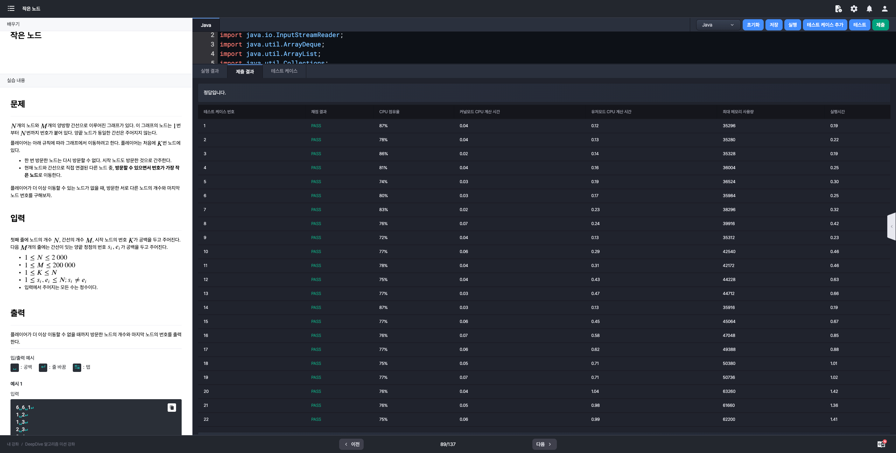

# 알고리즘 미션 - 그래프 탐색

---

## 영상처리

### 태그

그래프, BFS

### 풀이

- **문제 분석**

  - N X M 의 해상도를 가진 영상이 존재
  - 영상에서 마스킹 처리된 픽셀은 `#`, 그렇지 않은 픽셀은 `.`으로 표시됨.
  - 서로 다른 두 픽셀이 인접하면서 마스킹 처리가 되어 있다면, 두 픽셀은 같은 물체를 표현하는 픽셀이다.
  - 2차원 공간을 그래프 탐색 알고리즘(DFS, BFS)로 탐색하여 물체의 개수와 크기를 계산하면 된다.

- **입력**

  - 사진의 가로 크기 $N$, 세로 크기 $M$
  - 영상 데이터

    길이 $N$의 문자열 ($M$개의 줄)

- **출력**

  - 물체의 개수
  - 가장 큰 물체의 크기


### 소스코드

```java
import java.io.BufferedReader;
import java.io.InputStreamReader;
import java.util.ArrayList;
import java.util.Collections;
import java.util.LinkedList;
import java.util.List;
import java.util.Queue;

class Main {

    private static int N, M;
    private static char[][] matrix;
    private static boolean[][] visited;
    private static final Queue<Coords> queue = new LinkedList<>();

    public static void main(String[] args) throws Exception {
        BufferedReader br = new BufferedReader(new InputStreamReader(System.in));
        String[] input = br.readLine().split(" ");
        N = Integer.parseInt(input[0]);
        M = Integer.parseInt(input[1]);
        visited = new boolean[M][N];

        matrix = new char[M][N];
        for (int i = 0; i < M; i++) {
            String line = br.readLine();
            for (int j = 0; j < N; j++) matrix[i][j] = line.charAt(j);
        }

        List<Integer> objs = new ArrayList<>();
        for (int i = 0; i < M; i++) {
            for (int j = 0; j < N; j++) {
                if (visited[i][j] || matrix[i][j] == '.') continue;
                objs.add(bfs(i, j));
            }
        }

        System.out.println(objs.size());
        System.out.println(Collections.max(objs));
    }

    private static int bfs(int i, int j) {
        visited[i][j] = true;
        queue.offer(new Coords(i, j));
        int size = 1;

        while (!queue.isEmpty()) {
            Coords coords = queue.poll();
            int x = coords.x, y = coords.y;
            if (x - 1 >= 0 && !visited[x - 1][y] && matrix[x - 1][y] == '#')    // 상단 탐색
                size += process(x - 1, y);
            if (x + 1 < M && !visited[x + 1][y] && matrix[x + 1][y] == '#')     // 하단 탐색
                size += process(x + 1, y);
            if (y - 1 >= 0 && !visited[x][y - 1] && matrix[x][y - 1] == '#')    // 좌측 탐색
                size += process(x, y - 1);
            if (y + 1 < N && !visited[x][y + 1] && matrix[x][y + 1] == '#')     // 우측 탐색
                size += process(x, y + 1);
        }

        return size;
    }

    private static int process(int x, int y) {
        visited[x][y] = true;
        queue.offer(new Coords(x, y));

        return 1;
    }

    static class Coords {
        int x;
        int y;

        public Coords(int x, int y) {
            this.x = x;
            this.y = y;
        }
    }
}
```

### 실행결과


---

## 불이야!!

### 태그

그래프, BFS

### 풀이

- **문제 분석**
  - 불은 1초가 지날 때마다 사방으로 1칸씩 번져 붙는다.
  - 2차원 공간상에서 데이터가 '@'인 칸에서 출발하여 '&'인 칸까지 도착하는데 걸리는 시간을 구하면 된다.
- **입력 (모두 정수)**
  - 행의 개수 $R$, 열의 개수 $C$
    - $1 \le R,C \le 1,000; ~ R \times C \ge 2$
    - $S_{ij} \in$ {`.`, `#`, `&`, `@`}
  - 길이 $C$인 문자열 $S_{ij}$ ($R$개의 줄)
    - `&`이 두 개 이상 포함되는 경우는 주어지지 않는다 -> 2차원 공간에 사람은 구름이 한 명만 존재
    - `@`이 포함되지 않는 경우는 주어지지 않는다 -> 2차원 공간의 최초 상태에는 무조건 발화 지점이 존재한다.
- **출력**
  - 구름이가 최대한 논문을 챙길 수 있는 시간
  - 단, 구름이와 사방으로 인접한 칸에 불이 붙을 수 없다면 `-1`을 출력

### 소스코드

```java
import java.io.BufferedReader;
import java.io.InputStreamReader;
import java.util.LinkedList;
import java.util.Queue;

class Main {

    private static final int[] dx = {-1, 1, 0, 0};
    private static final int[] dy = {0, 0, -1, 1};
    private static final Queue<Coords> queue = new LinkedList<>();

    private static int R, C;
    private static Cell[][] matrix;

    public static void main(String[] args) throws Exception {
        BufferedReader br = new BufferedReader(new InputStreamReader(System.in));
        String[] input = br.readLine().split(" ");
        R = Integer.parseInt(input[0]);
        C = Integer.parseInt(input[1]);
        matrix = new Cell[R][C];

        Coords goormLoc = null;
        for (int i = 0; i < R; i++) {
            String line = br.readLine();
            for (int j = 0; j < C; j++) {
                char info = line.charAt(j);
                matrix[i][j] = new Cell(info);
                if (info == '&') {
                    goormLoc = new Coords(i, j);
                }
            }
        }

        detectIgnitionPoint();
        bfs();
        printResult(goormLoc);
    }

    // 발화지점 확인 메소드
    private static void detectIgnitionPoint() {
        for (int i = 0; i < R; i++) {
            for (int j = 0; j < C; j++) {
                if (matrix[i][j].type == '@') {
                    queue.offer(new Coords(i, j));
                    matrix[i][j].visited = true;
                }
            }
        }
    }

    private static void bfs() {
        while (!queue.isEmpty()) {
            Coords coords = queue.poll();
            int row = coords.row, col = coords.col;

            for (int i = 0; i < 4; i++) {
                int x = row + dx[i];
                int y = col + dy[i];

                if (calcCoordsInRange(x, y) && matrix[x][y].type != '#' && !matrix[x][y].visited) {
                    process(row, col, x, y);
                }
            }
        }
    }

    // 불이 옮겨갈 장소가 범위 내의 좌표인지 계산하는 메소드
    private static boolean calcCoordsInRange(int x, int y) {
        return x >= 0 && x < R && y >= 0 && y < C;
    }

    // 불이 옮겨간 이후의 작업들을 수행하는 메소드
    private static void process(int row, int col, int x, int y) {
        matrix[x][y].visited = true;
        matrix[x][y].distance = matrix[row][col].distance + 1;
        queue.offer(new Coords(x, y));
    }

    // 결과 출력 메서드
    private static void printResult(Coords goormLoc) {
        int row = goormLoc.row;
        int col = goormLoc.col;

        if (matrix[row][col].type == '&') {
            if (!matrix[row][col].visited) {
                System.out.println(-1);
            } else {
                System.out.println(matrix[row][col].distance - 1);
            }
        }
    }

    static class Coords {
        int row;
        int col;

        public Coords(int row, int col) {
            this.row = row;
            this.col = col;
        }
    }

    static class Cell {
        char type;
        boolean visited;
        int distance;

        public Cell(char type) {
            this.type = type;
            this.visited = false;
            this.distance = 0;
        }
    }
}
```

### 실행결과


---

## 작은 노드

### 태그

그래프, BFS

### 풀이

- **문제 분석**
  - 흔한 그래프 탐색 문제 중 하나이다. DFS 또는 BFS로 해결하면 된다.
  - 고려해야 할 사항은 다음과 같다.
    - 한 번 방문한 노드는 다시 방문할 수 없다. 시작 노드도 방문한 것으로 간주한다 -> 방문 배열 사용
    - 현재 노드와 간선으로 직접 연결된 다른 노드 중, 방문할 수 있으면서 번호가 가장 작은 노드로 이동한다. -> 이웃한 노드 정렬 필요
- **입력**
  - 노드의 개수 $N$, 간선의 개수 $M$, 시작 노드의 번호 $K$
    - $1 \le N \le 2,000$
    - $1 \le M \le 200,000$
    - $1 \le K \le N$
  - 간선이 잇는 양끝 정점의 번호 $s_{i},e_{i}$($M$개의 줄)
    - $1 \le s_{i}$
- **출력**
  - 플레이어가 더 이상 이동할 수 없을 때까지 방문한 노드의 개수와 마지막 노드의 번호

### 소스코드

```java
import java.io.BufferedReader;
import java.io.InputStreamReader;
import java.util.ArrayDeque;
import java.util.ArrayList;
import java.util.Collections;
import java.util.Deque;
import java.util.LinkedList;
import java.util.List;

class Main {

    public static void main(String[] args) throws Exception {
        BufferedReader br = new BufferedReader(new InputStreamReader(System.in));
        String[] input = br.readLine().split(" ");
        int N = Integer.parseInt(input[0]), M = Integer.parseInt(input[1]), K = Integer.parseInt(input[2]);

        List<List<Integer>> graph = new ArrayList<>();
        for (int i = 0; i < N + 1; i++) {
            graph.add(new LinkedList<>());
        }

        for (int i = 0; i < M; i++) {
            input = br.readLine().split(" ");
            int s = Integer.parseInt(input[0]), e = Integer.parseInt(input[1]);
            graph.get(s).add(e);
            graph.get(e).add(s);
        }

        bfs(graph, N, K);
    }

    private static void bfs(List<List<Integer>> graph, int N, int K) {
        boolean[] visited = new boolean[N + 1];
        Deque<Integer> q = new ArrayDeque<>();
        q.add(K);
        int answer = 0;
        int leastVisited = K;
        while (!q.isEmpty()) {
            leastVisited = q.poll();
            visited[leastVisited] = true;
            answer++;
            List<Integer> neighbors = graph.get(leastVisited);
            if (neighbors != null && !neighbors.isEmpty()) {
                Collections.sort(neighbors);
                for (int node : neighbors) {
                    if (!visited[node]) {
                        q.add(node);
                        break;
                    }
                }
            }
        }
        System.out.println(answer + " " + leastVisited);
    }
}
```

### 실행결과



---

## 세계 여행

### 태그

그래프

### 풀이

- **문제 분석**
- **입력**
- **출력**

### 소스코드

```java

```

### 실행결과

---

## 택시 기사 구름이

### 태그

그래프

### 풀이

- **문제 분석**
- **입력**
- **출력**

### 소스코드

```java

```

### 실행결과

