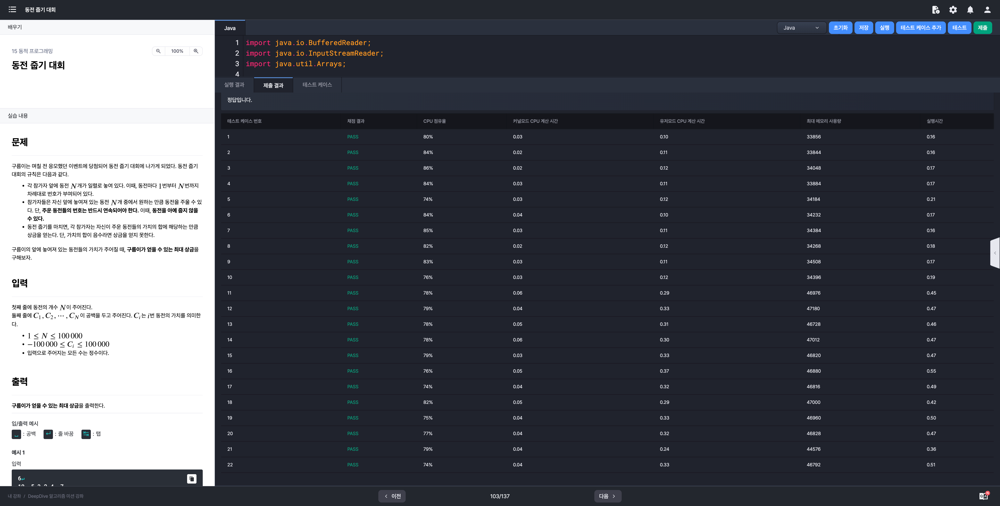
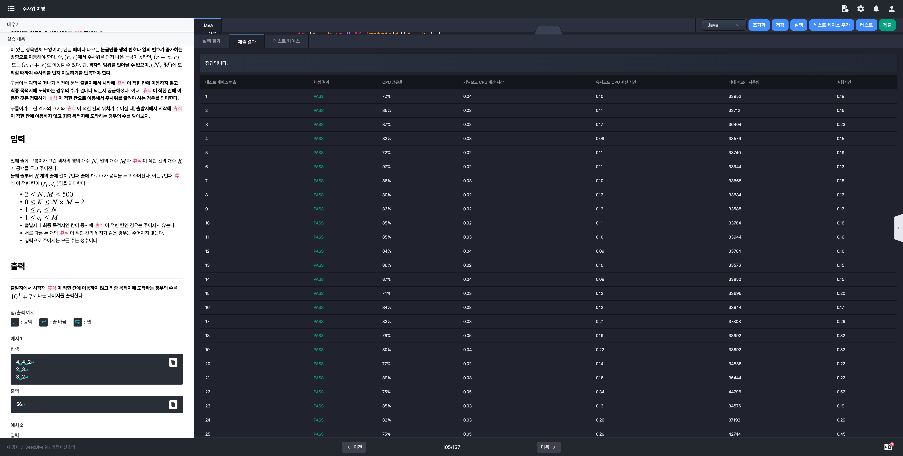
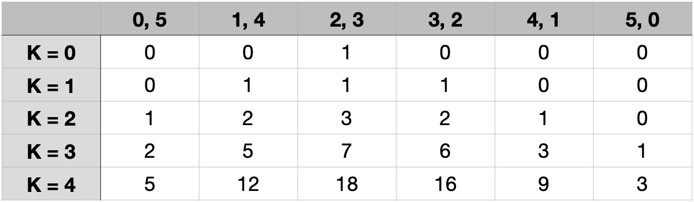
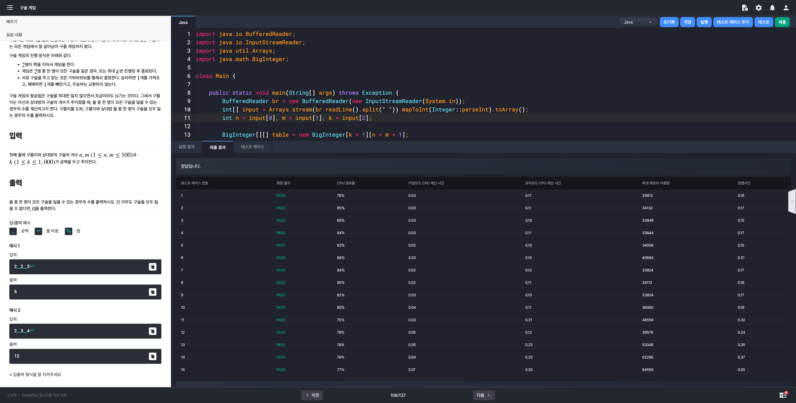
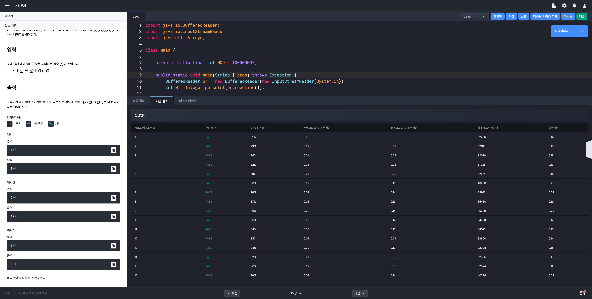

# 알고리즘 미션 - 동적 프로그래밍

---

## 피보나치 수열

### 태그

DP

### 풀이

- **문제 분석**
  
  - N의 최대값이 1,000,000 이므로 재귀를 활용하는 탑다운 방식을 사용하면 Call Stack이 넘치게되어 StackOverflowException이 발생한다.

  - 따라서, 반복문을 사용하는 바텀업 방식을 채택해서 문제를 해결해야한다.

- **입력**

  - 양의 정수 N

    $1 \le N \le 1,000,000$

- **출력**

  - 피보나치 수열의 $N$번째 항을 $10^{9} + 7$로 나눈 나머지


### 소스코드

```java
import java.io.BufferedReader;
import java.io.InputStreamReader;

class Main {
  
  private static final int MOD_NUM = 1000000007;
  
	public static void main(String[] args) throws Exception {
		BufferedReader br = new BufferedReader(new InputStreamReader(System.in));
		int N = Integer.parseInt(br.readLine());
		int[] arr = new int[N];

		if (N == 1 || N == 2) {
			System.out.println(N - 1);
			return;
		}

		// 두번째 값 초기화
		arr[1] = 1;

		for (int i = 2; i < N; i++) {
			arr[i] = (arr[i - 2] + arr[i - 1]) % MOD_NUM;
		}

		System.out.println(arr[N - 1] % MOD_NUM);
	}
}
```

### 실행결과


---

## 동전 줍기 대회

### 태그

DP

### 풀이

- **문제 분석**

  - 합 배열을 이용해서 정답을 구해야한다.

  - 단, 이 문제의 합 배열은 기존의 합 배열과는 달리 합 배열의 이전값이 음수일 경우 0으로 치환하여 더한다.

  - 또한, 가치의 합이 음수라면 상금을 얻지 못하므로 최종값은 0이 된다.

- **입력 (모두 정수)**

  - 동전의 개수 $N$

    $1 \le N \le 100,000$

  - 동전의 가치 $C_{1},C_{2},\cdots,C_{N}$

    $-100,000 \le C_{i} \le 100,000$

- **출력**

  구름이가 얻을 수 있는 최대 상금


### 소스코드

```java
import java.io.BufferedReader;
import java.io.InputStreamReader;
import java.util.Arrays;

class Main {
  
    public static void main(String[] args) throws Exception {
        BufferedReader br = new BufferedReader(new InputStreamReader(System.in));
        int N = Integer.parseInt(br.readLine());
        int[] C = Arrays.stream(br.readLine().split(" ")).mapToInt(Integer::parseInt).toArray();

        long[] sumArr = new long[N];
        sumArr[0] = C[0];
        for (int i = 1; i < N; i++) {
            sumArr[i] = Math.max(0L, sumArr[i - 1]) + C[i];
        }

        System.out.println(Math.max(0L, Arrays.stream(sumArr).max().getAsLong()));
    }
}
```

### 실행결과



---

## 주사위 여행

### 태그

DP

### 풀이

- **문제 분석**

  - 다른 문제들과 마찬가지로 점화식을 도출해서 문제를 해결하면 된다.

- **입력**

  - 행의 개수 $N$, 열의 개수 $M$, 휴식칸 개수 $K$

    $2 \le N,M \le 500$

    $0 \le K \le N \times M - 2$

  - 휴식이 적힌 칸의 인덱스 $r_{i}, c_{i}$ ($K$개의 라인)

    $1 \le r_{i} \le N$

    $1 \le c_{i} \le M$

- **출력**

  - 출발지에서 시작해 휴식이 적힌 칸에 이동하지 않고 최종 목적지에 도달하는 경우의 수를 $10^{9} + 7$로 나눈 나머지


### 소스코드 - 반복문을 활용한 바텀업 방식

```java
import java.io.BufferedReader;
import java.io.InputStreamReader;
import java.util.Arrays;

class Main {
  
    private static final int MOD_NUM = 1000000007;

    public static void main(String[] args) throws Exception {
        BufferedReader br = new BufferedReader(new InputStreamReader(System.in));
        int[] line = Arrays.stream(br.readLine().split(" ")).mapToInt(Integer::parseInt).toArray();
        int N = line[0], M = line[1], K = line[2];

        boolean[][] matrix = new boolean[N][M];
        for (int i = 0; i < K; i++) {
            line = Arrays.stream(br.readLine().split(" ")).mapToInt(Integer::parseInt).toArray();
            matrix[line[0] - 1][line[1] - 1] = true;
        }

        // DP 배열 선언후 시작지점 값 초기화
        int[][] cases = new int[N][M]; cases[0][0] = 1;
        for (int i = 0; i < N; i++) {
            for (int j = 0; j < M; j++) {
                // 주사위에서 나올 수 있는 경우의 수를 모두 계산
                for (int k = 1; k <= 6; k++) {
                    if (i - k >= 0 && !matrix[i - k][j]) {
                        cases[i][j] = (cases[i][j] + cases[i - k][j]) % MOD_NUM;
                    }

                    if (j - k >= 0 && !matrix[i][j - k]) {
                        cases[i][j] = (cases[i][j] + cases[i][j - k]) % MOD_NUM;
                    }
                }
            }
        }

        System.out.println(cases[N - 1][M - 1]);
    }
}
```

### 소스코드 - 재귀를 활용한 탑다운 방식

```java
import java.io.BufferedReader;
import java.io.InputStreamReader;
import java.util.Arrays;

class Main {

    private static final int MOD_NUM = 1000000007;

    private static int N, M, K;
    private static boolean[][] matrix;
    private static int[][] cases;

    public static void main(String[] args) throws Exception {
        BufferedReader br = new BufferedReader(new InputStreamReader(System.in));
        int[] line = Arrays.stream(br.readLine().split(" ")).mapToInt(Integer::parseInt).toArray();
        N = line[0];
        M = line[1];
        K = line[2];

        matrix = new boolean[N][M];
        for (int i = 0; i < K; i++) {
            line = Arrays.stream(br.readLine().split(" ")).mapToInt(Integer::parseInt).toArray();
            matrix[line[0] - 1][line[1] - 1] = true;
        }

        // DP 배열 선언후 시작지점 값 초기화
        cases = new int[N][M];
        Arrays.stream(cases).forEach(arr -> Arrays.fill(arr, -1));

        System.out.println(dp(0, 0));
    }

    private static int dp(int i, int j) {
        if (i == N - 1 && j == M - 1) {
            return 1;
        }

        if (cases[i][j] != -1) {
            return cases[i][j];
        }

        cases[i][j] = 0;

        // 주사위에서 나올 수 있는 경우의 수를 모두 계산
        for (int k = 1; k <= 6; k++) {
            if (i + k < N && !matrix[i + k][j]) {
                cases[i][j] += dp(i + k, j);
                cases[i][j] %= MOD_NUM;
            }
            if (j + k < M && !matrix[i][j + k]) {
                cases[i][j] += dp(i, j + k);
                cases[i][j] %= MOD_NUM;
            }
        }

        return cases[i][j];
    }
}
```

### 실행결과



---

## 구슬 게임

### 태그

DP

### 풀이

- **문제 분석**

  

  

  위 과정을 통해 규칙성을 찾을 수 있다.

- **입력**

  두 사람의 구슬 개수 $n, m$, 게임 횟수 $k$

  - $1 \le n,m \le 100$

  - $1 \le k \le 1,000$

- **출력**

  둘 중 한 명이 모든 구슬을 잃을 수 있는 경우 -> 구름이 또는 상대방이 우승하는 경우의 수의 합

### 소스코드

```java
import java.io.BufferedReader;
import java.io.InputStreamReader;
import java.util.Arrays;
import java.math.BigInteger;

class Main {

    public static void main(String[] args) throws Exception {
        BufferedReader br = new BufferedReader(new InputStreamReader(System.in));
        int[] input = Arrays.stream(br.readLine().split(" ")).mapToInt(Integer::parseInt).toArray();
        int n = input[0], m = input[1], k = input[2];

        BigInteger[][] table = new BigInteger[k + 1][n + m + 1];
        Arrays.stream(table).forEach(arr -> Arrays.fill(arr, BigInteger.ZERO));
        table[0][n] = BigInteger.ONE; // 초기값 설정

        for (int i = 0; i < k; i++) {
            for (int j = 1; j < n + m; j++) {
                table[i + 1][j - 1] = table[i + 1][j - 1].add(table[i][j]);
                table[i + 1][j] = table[i + 1][j].add(table[i][j]);
                table[i + 1][j + 1] = table[i + 1][j + 1].add(table[i][j]);
            }
        }

        BigInteger sum = BigInteger.ZERO;
        for (int i = 1; i <= k; i++) {
            sum = sum.add(table[i][0]).add(table[i][n + m]);
        }

        System.out.println(sum);
    }
}
```

### 실행결과



---

## 거리두기

### 태그

DP

### 풀이

- **문제 분석**

  - 어떤 한 테이블에 사람이 존재하면 앞뒤와 양옆으로 인접한 테이블에는 착석 불가
  - 형성 가능한 케이스
    - (X, X, X)
    - (O, X, X)
    - (X, O, X)
    - (X, X, O)
    - (O, X, O)
  - 첫 번째 줄(N = 1)에는 위의 모든 경우가 올 수 있다. 그렇다면 N이 2 이상이 되면 어떻게 될까?
    인접한 사방의 테이블에 착석이 불가하다는 조건을 반영하면 각 케이스의 다음에 형성 가능한 케이스들은 위와 같이 형성된다.
    - (X, X, X) -> (X, X, X), (O, X, X), (X, O, X), (X, X, O), (O, X, O)
    - (O, X, X) -> (X, X, X), (X, O, X), (X, X, O)
    - (X, O, X) -> (X, X, X), (O, X, X), (X, X, O), (O, X, O)
    - (X, X, O) -> (X, X, X), (O, X, X), (X, O, X)
    - (O, X, O) -> (X, X, X), (X, O, X)
  - 이러한 규칙을 실제 코드를 구현해내면 된다.

- **입력**

  테이블의 줄 수 $N$ ($1 \le N \le 100,000$)

- **출력**

  구름이가 테이블에 스티커를 붙일 수 있는 모든 경우의 수를 100,000,007로 나눈 나머지

### 소스코드

```java
import java.io.BufferedReader;
import java.io.InputStreamReader;
import java.util.Arrays;

class Main {

	private static final int MOD = 100000007;
	
	public static void main(String[] args) throws Exception {
		BufferedReader br = new BufferedReader(new InputStreamReader(System.in));
		int N = Integer.parseInt(br.readLine());

		// 앞뒤 양옆 비활성화
		// Single row Cases. (X, X, X), (O, X, X), (X, O, X), (X, X, O), (O, X, O)
		int[][] dp = new int[N][5];

		Arrays.fill(dp[0], 1);
		
		for (int i = 1; i < N; i++) {
			dp[i][0] = (dp[i - 1][0] + dp[i - 1][1] + dp[i - 1][2] + dp[i - 1][3] + dp[i - 1][4]) % MOD;
			dp[i][1] = (dp[i - 1][0] + dp[i - 1][2] + dp[i - 1][3]) % MOD;
			dp[i][2] = (dp[i - 1][0] + dp[i - 1][1] + dp[i - 1][3] + dp[i - 1][4]) % MOD;
			dp[i][3] = (dp[i - 1][0] + dp[i - 1][1] + dp[i - 1][2]) % MOD;
			dp[i][4] = (dp[i - 1][0] + dp[i - 1][2]) % MOD;
		}

		int sum = 0;
		for (int i = 0; i < 5; i++) {
			sum = (sum + dp[N - 1][i]) % MOD;
		}

		System.out.println(sum);
	}
}
```

### 실행결과



---

## 학점 예측하기

### 태그

### 풀이

- **문제 분석**

- **입력**

- **출력**

### 소스코드

```java

```

### 실행결과