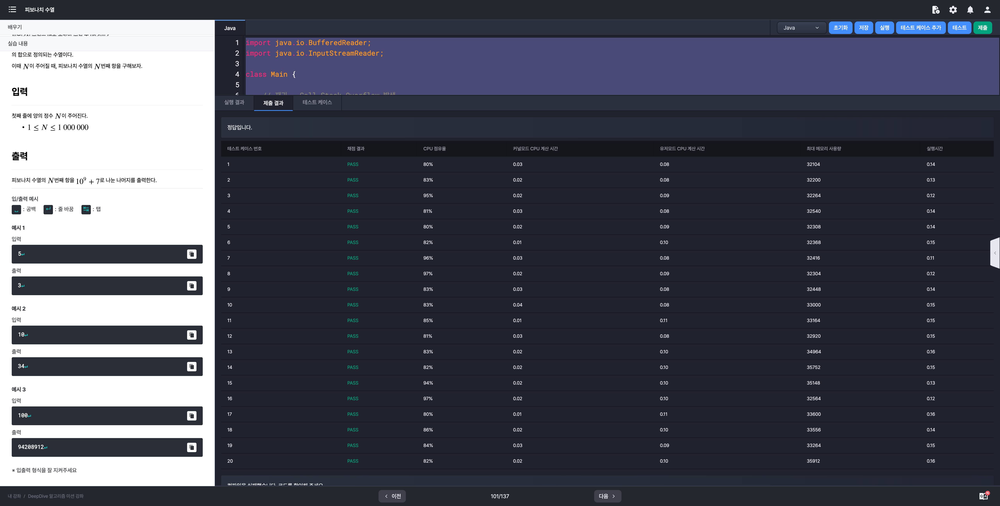

# 알고리즘 미션 - 동적 프로그래밍

---

## 피보나치 수열

### 태그

DP

### 풀이

- **문제 분석**
  
  - N의 최대값이 1,000,000 이므로 재귀를 활용하는 탑다운 방식을 사용하면 Call Stack이 넘치게되어 StackOverflowException이 발생한다.

  - 따라서, 반복문을 사용하는 바텀업 방식을 채택해서 문제를 해결해야한다.

- **입력**

  - 양의 정수 N

    $1 \le N \le 1,000,000$

- **출력**

  - 피보나치 수열의 $N$번째 항을 $10^{9} + 7$로 나눈 나머지


### 소스코드

```java
import java.io.BufferedReader;
import java.io.InputStreamReader;

class Main {
  
  private static final int MOD_NUM = 1000000007;
  
	public static void main(String[] args) throws Exception {
		BufferedReader br = new BufferedReader(new InputStreamReader(System.in));
		int N = Integer.parseInt(br.readLine());
		int[] arr = new int[N];

		if (N == 1 || N == 2) {
			System.out.println(N - 1);
			return;
		}

		// 두번째 값 초기화
		arr[1] = 1;

		for (int i = 2; i < N; i++) {
			arr[i] = (arr[i - 2] + arr[i - 1]) % MOD_NUM;
		}

		System.out.println(arr[N - 1] % MOD_NUM);
	}
}
```

### 실행결과



---

## 동전 줍기 대회

### 태그

### 풀이

- **문제 분석**

- **입력 (모두 정수)**

- **출력**


### 소스코드

```java

```

### 실행결과


---

## 주사위 여행

### 태그


### 풀이

- **문제 분석**

- **입력**

- **출력**

### 소스코드

```java

```

### 실행결과


---

## 구슬 게임

### 태그

### 풀이

- **문제 분석**

- **입력**

- **출력**

### 소스코드

```java

```

### 실행결과


---

## 거리두기

### 태그

### 풀이

- **문제 분석**

- **입력**

- **출력**

### 소스코드

```java

```

### 실행결과


---

## 학점 예측하기

### 태그

### 풀이

- **문제 분석**

- **입력**

- **출력**

### 소스코드

```java

```

### 실행결과