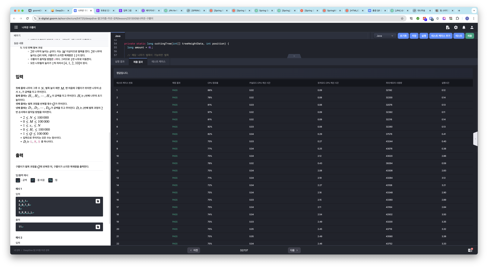
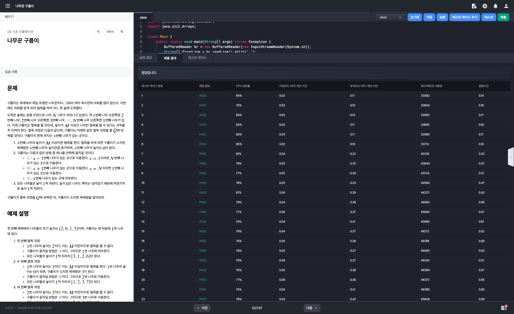

# 알고리즘 미션 - 기초 시뮬레이션

---

## 나무꾼 구름이

### 소스코드

```java
import java.io.*;
import java.util.StringTokenizer;
import java.util.Arrays;

class Main {
    private static int treesCount;
    private static int startPosition;
    private static int cuttingCriteria;
    private static int cuttingChance;

    public static void main(String[] args) throws Exception {
        BufferedReader br = new BufferedReader(new InputStreamReader(System.in));
        String[] firstLine = br.readLine().split(" ");

        treesCount = Integer.parseInt(firstLine[0]);
        cuttingCriteria = Integer.parseInt(firstLine[1]);
        startPosition = Integer.parseInt(firstLine[2]);

        int[] treeHeightData = new int[treesCount];
        StringTokenizer st = new StringTokenizer(br.readLine());
        for (int i = 0; i < treesCount; i++) {
            treeHeightData[i] = Integer.parseInt(st.nextToken());
        }

        cuttingChance = Integer.parseInt(br.readLine());
        String[] directionData = new String[cuttingChance];
        st = new StringTokenizer(br.readLine());
        for (int i = 0; i < cuttingChance; i++) {
            directionData[i] = st.nextToken();
        }

        long result = logic(treeHeightData, directionData);

        System.out.println(result);
    }

    private static long logic(int[] treeHeightData, String[] directionData) {
        long woodAmount = 0L;

        int position = startPosition - 1;

        for (int i = 0; i < cuttingChance; i++) {
            // 벌목
            woodAmount += cuttingTree(treeHeightData, position);
            // 위치 이동
            position = movePosition(directionData[i], position);
            // 나무 성장
            treeGrow(treeHeightData);
        }

        return woodAmount;
    }

    private static long cuttingTree(int[] treeHeightData, int position) {
        long amount = 0L;

        // 해당 나무가 벌목이 가능하면 벌목
        if (treeHeightData[position] >= cuttingCriteria) {
            // 나무를 벌목 -> 목재량이 증가한다.
            amount = treeHeightData[position];
            // 벌목한 나무의 높이가 0이 된다.
            treeHeightData[position] = 0;
        }

        return amount;
    }

    private static int movePosition(String direction, int position) {
        if (direction.equals("L")) {
            // 현재 위치가 배열의 첫 번째 요소일 경우 배열의 마지막 요소로 이동
            if (position == 0) {
                return treesCount - 1;
            }
            return position - 1;
        }

        if (direction.equals("R")) {
            // 현재 위치가 배열의 마지막 요소일 경우 배열의 첫번째 요소로 이동
            if (position == treesCount - 1) {
                return 0;
            }
            return position + 1;
        }

        return position;
    }

    private static void treeGrow(int[] treeHeightData) {
        // 벌목과 이동이 모두 끝나면 나무가 1만큼 성장한다.
        for (int j = 0; j < treeHeightData.length; j++) {
            treeHeightData[j] += 1;
        }
    }
}
```

### 소스코드 - 실행 시간 개선

```java
import java.io.*;
import java.util.StringTokenizer;
import java.util.Arrays;

class Main {

    private static int N;
    private static int M;
    private static int X;

    public static void main(String[] args) throws Exception {
        BufferedReader br = new BufferedReader(new InputStreamReader(System.in));
        String[] firstLine = br.readLine().split(" ");

        N = Integer.parseInt(firstLine[0]);
        M = Integer.parseInt(firstLine[1]);
        X = Integer.parseInt(firstLine[2]) - 1;

        int[] H = Arrays.stream(br.readLine().split(" ")).mapToInt(Integer::parseInt).toArray();
        int Q = Integer.parseInt(br.readLine());
        String[] D = br.readLine().split(" ");

        long result = logic(H, D);

        System.out.println(result);
    }

    private static long logic(int[] H, String[] D) {
        long result = 0L;

        for (int i = 0; i < D.length; i++) {
            result += cuttingTree(H, i);
            movePosition(D[i]);
        }

        return result;
    }

    private static long cuttingTree(int[] H, int i) {
        if (H[X] + i >= M) {
            long val = H[X] + i;
            H[X] -= val;

            return val;
        }
        return 0L;
    }

    private static void movePosition(String direction) {
        if (direction.equals("L")) {
            X = (X - 1 + N) % N;
        } else if (direction.equals("R")) {
            X = (X + 1) % N;
        }
    }
}
```

### 실행결과





---

## 복제 로봇

### 소스코드

```java
import java.io.BufferedReader;
import java.io.InputStreamReader;
import java.util.Arrays;

class Main {
    public static void main(String[] args) throws Exception {
        BufferedReader br = new BufferedReader(new InputStreamReader(System.in));
        int[] input = Arrays.stream(br.readLine().split(" ")).mapToInt(Integer::parseInt).toArray();

        Coord current = new Coord(input[0], input[1]); // 초기 좌표
        int N = Integer.parseInt(br.readLine()); // 웅덩이 개수

        Coord[] ponds = new Coord[N]; // 웅덩이 분포 정보
        for (int i = 0; i < N; i++) {
            input = Arrays.stream(br.readLine().split(" ")).mapToInt(Integer::parseInt).toArray();
            ponds[i] = new Coord(input[0], input[1]);
        }

        int Q = Integer.parseInt(br.readLine()); // 조종 횟수
        String[] commands = br.readLine().split(" "); // 이동 커맨드 정보

        // 이동 명령 처리
        for (String command : commands) {
            DestCoord dest = new DestCoord(current.getX(), current.getY());
            if (command.equals("L")) { // 왼쪽으로 이동
                dest.moveLeft();
                moveToDest(current, dest, ponds);
            } else if (command.equals("R")) { // 오른쪽으로 이동
                dest.moveRight();
                moveToDest(current, dest, ponds);
            } else if (command.equals("U")) { // 상단으로 이동
                dest.moveForward();
                moveToDest(current, dest, ponds);
            } else { // 하단으로 이동
                dest.moveBack();
                moveToDest(current, dest, ponds);
            }
        }

        System.out.println(current.toString());
    }

    // 현재 위치 갱신
    private static void moveToDest(Coord current, DestCoord dest, Coord[] ponds) {
        if (!isDestIsPond(dest, ponds)) {
            current.setX(dest.getX());
            current.setY(dest.getY());
        }
    }

    // 가고자 하는 곳이 연못인지 확인
    private static boolean isDestIsPond(DestCoord dest, Coord[] ponds) {
        for (Coord pond : ponds) {
            if (dest.isThisCoordEqual(pond)) {
                return true;
            }
        }
        return false;
    }

    // 좌표 정보
    static class Coord {
        int x;
        int y;

        public Coord() {
        }

        public Coord(int x, int y) {
            this.x = x;
            this.y = y;
        }

        public int getX() {
            return x;
        }

        public void setX(int x) {
            this.x = x;
        }

        public int getY() {
            return y;
        }

        public void setY(int y) {
            this.y = y;
        }

        public boolean isThisCoordEqual(Coord coord) {
            return this.x == coord.x && this.y == coord.y;
        }

        public String toString() {
            return x + " " + y;
        }
    }

    // 이동 목표 좌표
    static class DestCoord extends Coord {
        public DestCoord(int x, int y) {
            this.x = x;
            this.y = y;
        }

        public void moveLeft() {
            this.x -= 1;
        }

        public void moveRight() {
            this.x += 1;
        }

        public void moveForward() {
            this.y += 1;
        }

        public void moveBack() {
            this.y -= 1;
        }
    }
}
```

### 실행결과


---

## 빵야

### 소스코드

```java
import java.io.*;
import java.util.Arrays;

class Main {
    public static void main(String[] args) throws Exception {
        BufferedReader br = new BufferedReader(new InputStreamReader(System.in));
        int N = Integer.parseInt(br.readLine());
        int[] H = Arrays.stream(br.readLine().split(" ")).mapToInt(Integer::parseInt).toArray();

        long totalCnt = 0;
        int damage = 0;

        /*
         * Key Point. 데미지는 1, 2, 3, 4로 순환한다.
         *
         * 우선 한 사이클을 돌려본다. (만약 사이클 중 적의 체력이 0이하로 내려간다면 중단)
         *
         * 한 사이클을 돌려도 체력이 남아있다면 아래 과정을 수행한다.
         *
         * 현재 데미지가 1이고 (i가 0) 적의 체력이 health라고 가정한다면
         * Math.round(health / 10) * 4번의 발사로 Math.round(health / 10) * 10 만큼의 데미지를 입힌다.
         * 이렇게 될 경우 적의 체력은 health % 10이 된다.
         *
         * 만약 적의 체력이 위 과정을 수행해도 남아있다면 다시 사이클을 돌려본다.
         */

        for (int health : H) {
            // 데미지가 1이 되기 전까지 & 적의 체력이 남아있는 동안 사격
            while (damage > 0 && health > 0) {
                health -= damage + 1;
                damage = (damage + 1) % 4;
                totalCnt++;
            }

            // 현재 체력이 0이하일 경우(적이 쓰러졌다면) 다음 적으로 목표 변경
            if (health <= 0) {
                continue;
            }

            // 위에서 도출한 수식을 활용하여 체력을 10미만으로 만든다.
            totalCnt += (health / 10) * 4;
            health %= 10;

            while (health > 0) {
                health -= damage + 1;
                damage = (damage + 1) % 4;
                totalCnt++;
            }
        }

        System.out.println(totalCnt);
    }
}
```

### 실행결과

