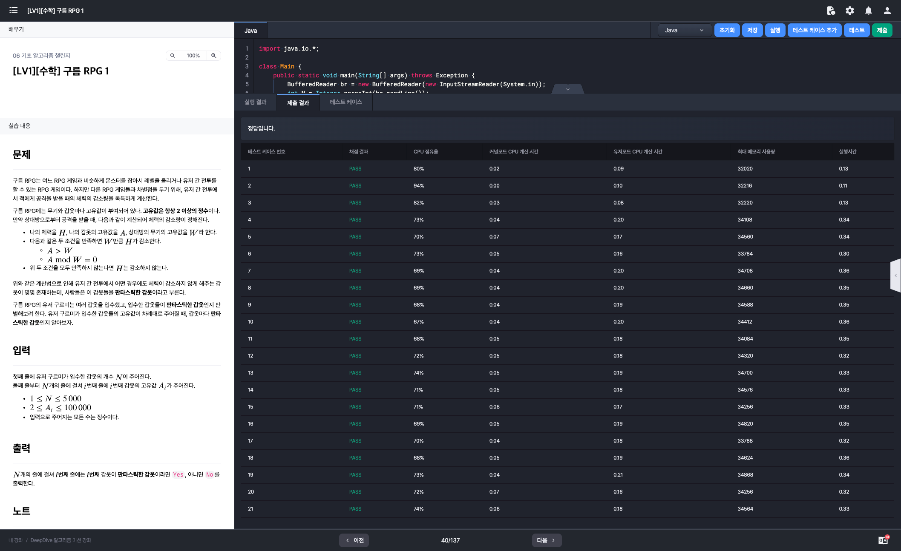
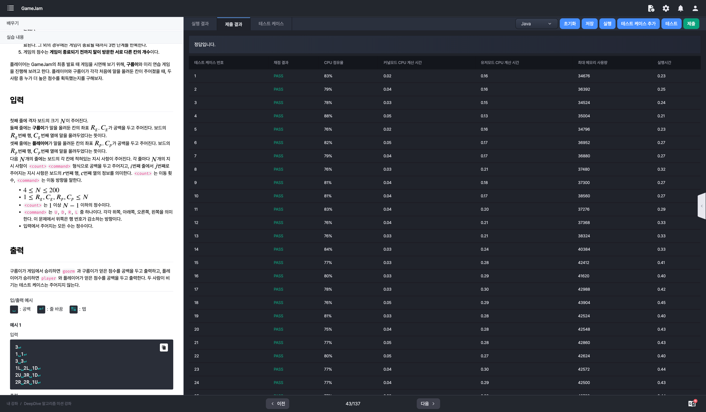

# 알고리즘 미션 - 기초 알고리즘 챌린지

---

## 시간복잡도

### 태그

정수론

### 풀이

- N의 최대값이 10^9 즉 10억 이므로 해당 문제는 long을 사용해도 변수의 표현 가능 범위를 초과하게 된다.
  1. 임의의 정수 X가 있다고 가정할 때 해당 변수의 뒤에 0이 붙기 위해서는 10이 곱해져야 한다.
  2. 10은 2와 5가 곱해져서 도출되는 정수이다.
  3. 따라서 X 뒤에 붙은 0의 개수는 X를 소인수분해 했을 때 5의 개수와 동일하다는 것을 알 수 있다.

- N!을 소인수분해했을 때의 5의 개수 == N을 5로 나눈 몫
  - e.g) 
    - 10!의 5의 뒤에 있는 연속된 0의 개수 = 10 * 9 * 8 * 7 * 6 * 5 * 4 * 3 * 2 * 1 = 3,628,800
    - 10 / 5 = 2
- 이러한 방식으로 입력으로 주어진 N이 5로 더 이상 나누어지지 않을 때까지 반복하면 뒤에 붙은 0의 개수를 도출해낼 수 있다.

### 소스코드

```java
import java.io.*;

class Main {
    public static void main(String[] args) throws Exception {
        BufferedReader br = new BufferedReader(new InputStreamReader(System.in));
        int N = Integer.parseInt(br.readLine()); // 1 <= N <= 10^9(=1000000000)
        int answer = 0;

        while (true) {
            if (N <= 0)
                break;

            answer += N / 5;
            N /= 5;
        }

        System.out.println(answer);
    }
}
```

### 실행결과


---

## 구름 RPG

### 태그

수학(소수), 에라토스테네스의 체

### 풀이

- 입력 (모두 정수)
  - 갑옷의 개수 N (최소 1, 최대 5,000)
  - N개의 라인의 갑옷 고유값 (최소 2, 최대 100,000)

- 데미지 계산식 (고유값은 항상 2이상의 정수)
  - 나의 체력 H, 나의 갑옷의 고유값(방어력) A, 상대방의 무기의 고유값(공격력) W
  - 아래 두 조건을 만족하면 공격력만큼 체력이 감소한다.
    - A(방어력) > W(공격력)
    - A(방어력) % W(공격력) = 0
  - 위 두 조건을 **모두 만족**하지 않는다면 체력은 감소하지 않는다.
- 판타스틱한 갑옷
  - 어떤 경우에도 체력이 감소하지 않는 갑옷
  - 즉, 갑옷의 고유값(방어력)이 **소수**이면 그 갑옷은 판타스틱한 갑옷이다.

### 소스코드

```java
import java.io.*;

class Main {
    public static void main(String[] args) throws Exception {
        BufferedReader br = new BufferedReader(new InputStreamReader(System.in));
        int N = Integer.parseInt(br.readLine());

        for (int i = 0; i < N; i++) {
            int armor = Integer.parseInt(br.readLine());
            if (isPrime(armor)) {
                System.out.println("Yes");
                continue;
            }
            System.out.println("No");
        }
    }

    private static boolean isPrime(int armor) {
        for (int i = 2; i <= armor / 2; i++) {
            if (armor % i == 0)
                return false;
        }
        return true;
    }
}
```

### 시간복잡도 개선 코드

```java
import java.io.*;

class Main {
    public static void main(String[] args) throws Exception {
        BufferedReader br = new BufferedReader(new InputStreamReader(System.in));
        int N = Integer.parseInt(br.readLine());

        for (int i = 0; i < N; i++) {
            int armor = Integer.parseInt(br.readLine());
            if (isPrime(armor)) {
                System.out.println("Yes");
                continue;
            }
            System.out.println("No");
        }
    }

    private static boolean isPrime(int armor) {
        if (armor == 2)
            return true; // 2는 소수
        if (armor % 2 == 0)
            return false; // 짝수는 2 제외하고 소수가 아님
        for (int i = 3; i <= (int) Math.sqrt(armor); i += 2) {
            if (armor % i == 0)
                return false;
        }
        return true;
    }
}
```

### 실행결과




---

## GameJam

### 태그

단순 구현, 시뮬레이션

### 풀이

- 입력 (모든 수는 정수)
  - 격자 보드의 크기 N
  - 구름이의 말 좌표 (rowG, colG)
  - 플레이어의 말 좌표 (rowP, colP)
  - N개의 라인
    - N개의 지시 사항(형식: <count><command>)
      - count: 1 이상 N-1 이하
      - command: U, D, L, R 중 하나

- 보드 게임 규칙
  1. N X N 크기의 보드에서 <command> 방향으로 <count> 만큼 이동
  2. 보드 게임 시작 시 보드의 칸 중 하나에 말을 올려놓는다 -> 어느 위치에 놓아도 상관 X
  3. 각 칸에 적힌 지시대로 말을 이동 (이동 중 보드 밖으로 나가게 된다면 반대쪽의 첫 칸으로 이동)
  4. 이동하다가 이미 한 번이라도 방문한 칸을 다시 지나야 할 경우에는 게임이 종료
     그 외에는 게임이 종료될 때까지 3번을 반복
  5. 최종 점수는 게임이 종료되기 전까지 말이 방문한 서로 다른 칸의 개수
- 출력
  - 구름이가 승리할 경우: 문자열 goorm과 구름이가 얻은 점수를 공백을 두고 출력
  - 플레이어가 승리할 경우: 문자열 player와 플레이어가 얻은 점수를 공백을 두고 출력

### 소스코드

```java
import java.io.BufferedReader;
import java.io.InputStreamReader;
import java.util.Arrays;
import java.util.HashMap;
import java.util.Map;

class Main {

    private static final Map<String, int[]> commandInfo = new HashMap<>() {
        {
            put("U", new int[] { -1, 0 });
            put("D", new int[] { 1, 0 });
            put("L", new int[] { 0, -1 });
            put("R", new int[] { 0, 1 });
        }
    };

    public static void main(String[] args) throws Exception {
        BufferedReader br = new BufferedReader(new InputStreamReader(System.in));
        int N = Integer.parseInt(br.readLine());

        Player goorm = initPlayerData("goorm", br.readLine());
        boolean[][] goormVisited = new boolean[N][N];
        Player player = initPlayerData("player", br.readLine());
        boolean[][] playerVisited = new boolean[N][N];

        BoardItem[][] board = new BoardItem[N][N];
        for (int i = 0; i < N; i++) {
            String[] input = br.readLine().split(" ");
            for (int j = 0; j < N; j++) {
                board[i][j] = new BoardItem(Integer.parseInt(input[j].substring(0, input[j].length() - 1)),
                        input[j].substring(input[j].length() - 1));
            }
        }

        logic(goorm, board, goormVisited);
        logic(player, board, playerVisited);

        if (goorm.score > player.score) {
            System.out.println(goorm.getResult());
        } else {
            System.out.println(player.getResult());
        }
    }

    private static void logic(Player player, BoardItem[][] board, boolean[][] visited) {
        int x = player.curX;
        int y = player.curY;
        visited[x][y] = true;
        boolean flag = true;

        while (flag) {
            BoardItem item = board[x][y];
            for (int i = 0; i < item.count; i++) {
                x += commandInfo.get(item.command)[0];
                y += commandInfo.get(item.command)[1];
                x = calcPos(x, board[0].length);
                y = calcPos(y, board[0].length);

                if (!visited[x][y]) {
                    visited[x][y] = true;
                    player.score += 1;
                } else {
                    flag = false;
                    break;
                }
            }
        }
    }

    private static int calcPos(int pos, int boardSize) {
        // 인덱스 범위를 넘어가는 경우에 대한 처리
        if (pos == -1)
            return boardSize - 1;
        if (pos == boardSize)
            return 0;
        return pos;
    }

    private static Player initPlayerData(String name, String input) {
        int[] data = Arrays.stream(input.split(" ")).mapToInt(Integer::parseInt).toArray();

        return new Player(name, data[0] - 1, data[1] - 1);
    }

    static class Player {
        String name;
        int curX;
        int curY;
        int score;

        public Player(String name, int curX, int curY) {
            this.name = name;
            this.curX = curX;
            this.curY = curY;
            this.score = 1;
        }

        public String getResult() {
            return name + " " + score;
        }
    }

    static class BoardItem {
        int count;
        String command;

        public BoardItem() {
        }

        public BoardItem(int count, String command) {
            this.count = count;
            this.command = command;
        }

        public String toString() {
            return count + " " + command;
        }
    }
}
```

### 실행결과

