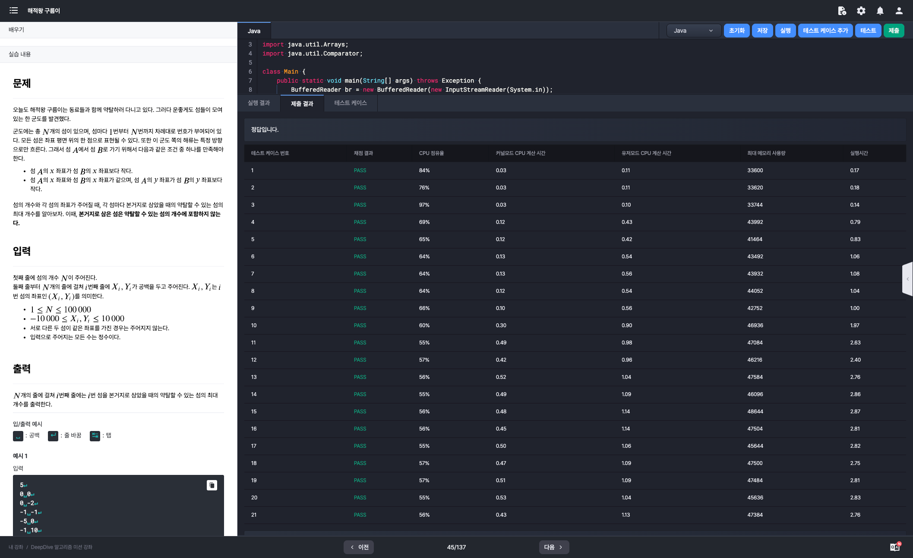
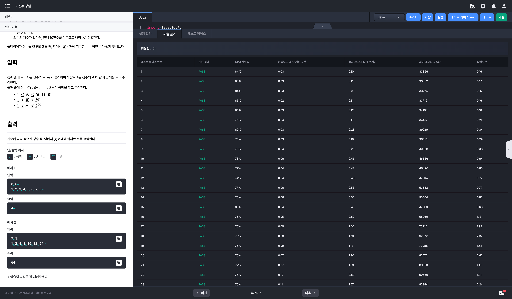

# 알고리즘 미션 - 정렬

---

## 해적왕 구름이

### 태그

정렬

### 풀이

- 입력
  - 섬의 개수 (정수 N)

  - 섬의 좌표 (N개의 라인 - 형식: [X Y])

- 섬 A에서 섬 B로 가기위한 조건
  - A.x < B.x
  - A.x == B.x && A.y < B.y

- 위 조건을 바탕으로 섬의 좌표를 오름차순으로 정렬하면 약탈 가능한 섬의 개수를 쉽게 구할 수 있다는 것을 도출할 수 있다.

### 소스코드

```java
import java.io.BufferedReader;
import java.io.InputStreamReader;
import java.util.Arrays;

class Main {
    public static void main(String[] args) throws Exception {
        BufferedReader br = new BufferedReader(new InputStreamReader(System.in));
        int N = Integer.parseInt(br.readLine());
        Island[] island = new Island[N];

        for (int i = 0; i < N; i++) {
            int[] input = Arrays.stream(br.readLine().split(" ")).mapToInt(Integer::parseInt).toArray();
            island[i] = new Island(i, input[0], input[1]);
        }

        Arrays.sort(island);

        int[] result = new int[N];
        for (int i = 0; i < N; i++)
            result[island[i].idx] = N - 1 - i;

        Arrays.stream(result).forEach(System.out::println);
    }

    static class Island implements Comparable<Island> {
        int idx;
        int x;
        int y;

        public Island(int idx, int x, int y) {
            this.idx = idx;
            this.x = x;
            this.y = y;
        }

        @Override
        public int compareTo(Island o) {
            if (this.x == o.x) {
                return this.y - o.y;
            }
            return this.x - o.x;
        }
    }
}
```

### 실행결과



---

## 이진수 정렬

### 태그

정렬

### 풀이

- 입력
  - 정수의 수 N, 플레이어가 찾으려는 정수의 위치 K (N: 1 이상 500,000이하, K: 1 이상 N 이하)
  - N개의 10진수 (공백으로 구분; 1 이상 2^20(1,048,576) 이하)
- 정렬 기준
  - 10진수 -> 2진수 변환
  - 2진수에 포함된 1의 개수를 기준으로 내림차순 정렬
  - 1의 개수가 같다면 10진수를 기준으로 내림차순 정렬
- K번째에 위치한 수를 구해야 한다.

### 소스코드 - 시간 초과

```java
import java.io.*;
import java.util.Arrays;
import java.util.Comparator;

class Main {
    public static void main(String[] args) throws Exception {
        BufferedReader br = new BufferedReader(new InputStreamReader(System.in));
        int[] input = Arrays.stream(br.readLine().split(" ")).mapToInt(Integer::parseInt).toArray();
        int N = input[0]; // 정수의 수
        int K = input[1]; // 플레이어가 찾으려는 정수의 위치

        input = Arrays.stream(br.readLine().split(" ")).mapToInt(Integer::parseInt).toArray();
        Element[] elems = new Element[N];
        for (int i = 0; i < N; i++) {
            elems[i] = new Element(input[i], Integer.toBinaryString(input[i]));
        }

        Arrays.sort(elems);

        System.out.println(elems[K - 1].decimalVal);
    }

    static class Element implements Comparable<Element> {
        int decimalVal;
        String binaryVal;

        public Element(int decimalVal, String binaryVal) {
            this.decimalVal = decimalVal;
            this.binaryVal = binaryVal;
        }

        @Override
        public int compareTo(Element o) {
            long e1Count = this.binaryVal.chars().filter(c -> c == '1').count();
            long e2Count = o.binaryVal.chars().filter(c -> c == '1').count();

            if (e1Count == e2Count) {
                return o.decimalVal - this.decimalVal;
            }

            return (int) (e2Count - e1Count);
        }
    }
}
```

### 소스 코드 - 시간초과 해결 코드

```java
import java.io.BufferedReader;
import java.io.InputStreamReader;
import java.util.Arrays;

class Main {
    public static void main(String[] args) throws Exception {
        BufferedReader br = new BufferedReader(new InputStreamReader(System.in));
        int[] input = Arrays.stream(br.readLine().split(" ")).mapToInt(Integer::parseInt).toArray();
        int N = input[0]; // 정수의 수
        int K = input[1]; // 플레이어가 찾으려는 정수의 위치

        Integer[] nums = Arrays.stream(br.readLine().split(" "))
                .mapToInt(Integer::parseInt)
                .boxed().toArray(Integer[]::new);

        // 1의 개수(내림차순) → 값 크기(내림차순) 정렬
        Arrays.sort(nums, (a, b) -> {
            int cntA = Integer.bitCount(a);
            int cntB = Integer.bitCount(b);
            return cntA != cntB ? Integer.compare(cntB, cntA) : Integer.compare(b, a);
        });

        System.out.println(nums[K - 1]);
    }
}
```

- 문제 상황) 기존 코드는 10진수를 입력받아서 2진수로 변환하고 2진수의 1의 개수를 Stream API를 이용하여 도출하였다.

  - 해당 방식으로 1의 개수를 구하게 되면 문자열을 차례대로 순회하며 1의 개수를 구하게 된다.

    -> 이는 시간복잡도를 증가시키는 요인이 되기에 충분했다.

- 해결책) Integer의 bitCount 메서드를 이용하여 1의 개수를 구하도록 코드를 수정하였다.

  - 그 결과 시간 초과가 발생하던 이전 코드와 달리 정상적으로 모든 테스트 케이스를 통과할 수 있었다.

### 실행결과

