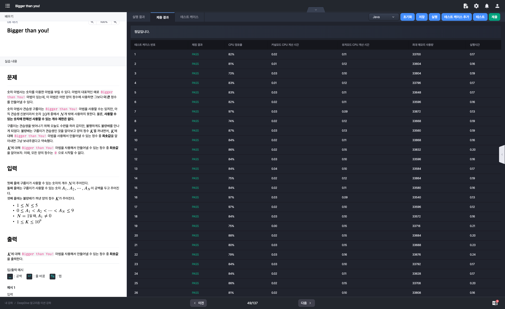
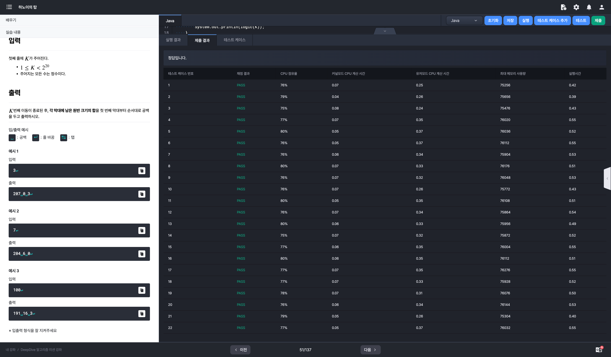

# 알고리즘 미션 - 재귀

---

## Bigger than you!

### 태그

재귀

### 풀이

- 입력
  - 구름이가 사용할 수 있는 숫자의 개수 N (1 이상 5 이하)

  - 구름이가 사용할 수 있는 N개의 숫자 A (각 숫자의 범위: 0 이상 9 이하)

  - 불량배가 꺼낸 양의 정수 K (1 이상 10^9(1,000,000,000) 이하)

- 구름이는 양의 정수에 `Bigger than You!` 마법을 사용할 수 있다.
  - 숫자 10개 (0 ~ 9) 중 N개만 사용할 수 있다.

  - 사용할 수 있는 숫자에 한해선 몇 번이고 사용가능하다.

- 문제의 설명이 무척 난해하다
  - K에 대해 `Bigger than You!` 마법을 사용하라는 문장이
    - K의 값을 이용하라는 것인지
    - 아니면 K보다 큰 정수 중 최솟값을 주어진 N개의 숫자를 바탕으로 만들어내라는 건지
  - 이 문제의 카테고리가 재귀라는 점을 고려하면 전자보다는 후자의 가능성이 더 높아보인다.
- 불량배가 제시하는 양의 정수 K의 최대 값이 10억 이므로 결과를 저장하는 변수는 int 보다 범위가 넓은 long으로 사용할 것이다.
- 메인 로직
  1. 초기값을 0으로 받는 메서드를 호출한다.
  2. 해당 메서드에서 배열 A의 값들을 바탕으로 양의 정수를 증가시킨다.
  3. 가장 작은 수를 구해야하기 때문에 재귀로 메서드를 다시 호출한다.
  4. 2, 3 과정을 K보다 큰 양의 정수 중 최솟값이 나올때까지 반복한다.

### 소스코드

```java
import java.io.BufferedReader;
import java.io.InputStreamReader;
import java.util.Arrays;

class Main {
	
	private static int N;
	private static int[] A;
	private static long K;
	private static long result;
	
	public static void main(String[] args) throws Exception {
		BufferedReader br = new BufferedReader(new InputStreamReader(System.in));
		N = Integer.parseInt(br.readLine());
		A = Arrays.stream(br.readLine().split(" ")).mapToInt(Integer::parseInt).toArray();
		K = Integer.parseInt(br.readLine());
		
		result = Long.MAX_VALUE;
		solution(0);
		
		System.out.println(result);
	}
	
	private static void solution(long num) {
		if (num > K) {
			result = Math.min(result, num);
			return;
		}
		for (int i = 0; i < N; i++) {
			long val = 10 * num + A[i];
			if (val == 0) continue;
			solution(val);
		}
	}
}
```

### 실행결과



---

## 하노이의 탑

### 태그

재귀

### 풀이

- 입력: 이동 횟수 K

- 출력: K번째 이동이 종료되었을 때 각 기둥에 존재하는 원반의 합 [e.g) 207 0 3]

- Condition

  - 해당 문제에서 주어진 하노이의 탑에는 초기에 첫번째 기둥에 20개의 원반이 존재한다.
  - 하노이의 탑 기본 규칙
    1. 한 번에 하나의 원반만 이동 가능
    2. 이동시 최상단에 존재하는 원반만 이동 가능
    3. 자신보다 크기가 작은 원반위에 이동 불가

- 하노이의 탑은 재귀 알고리즘을 가장 직관적으로 보여주는 문제 중 하나이다.

  - N 개의 원반을 첫번째 기둥에서 세번째 기둥으로 옮기기 위해서는

    - N이 1일 때
      - 출발지의 원판을 도착지로 옮긴다.

    - 나머지 케이스
      - 출발지에 있는 N - 1개의 원판을 경유지로 옮긴다.
      - 출발지에 있는 1개의 원판을 도착지로 옮긴다.
      - 경유지에 있는 N -1개의 원판을 도착지로 옮긴다.

  - 위 재귀식을 실제 소스코드로 구현하면 아래와 같다.

    ```java
    private static void hanoi(int n, int from, int to, int via) {
    		int[] move = {from, to};
    
        if (n == 1) {
    				MOVE_DATA.add(move);
            return;
        }
    
        hanoi(n - 1, from, via, to);
        MOVE_DATA.add(move);
        hanoi(n - 1, via, to, from);
    }
    ```

    - 각각의 호출마다 출발지와 도착지 위치를 int형 배열로 구성하여 이동 데이터에 추가한다.

- 위 재귀식이 끝나면 입력으로 주어진 K를 바탕으로 K번째 이동 시점의 각 기둥의 원반의 합을 도출한다.

### 소스코드

```java
import java.io.BufferedReader;
import java.io.InputStreamReader;
import java.util.ArrayList;
import java.util.List;
import java.util.Stack;

class Main {
		private static final int DISK_AMOUNT = 20;
    private static final List<int[]> MOVE_DATA = new ArrayList<>();

    public static void main(String[] args) throws Exception {
        BufferedReader br = new BufferedReader(new InputStreamReader(System.in));
        int K = Integer.parseInt(br.readLine());

        hanoi(DISK_AMOUNT, 1, 3, 2);

        System.out.println(logic(K));
    }

    private static void hanoi(int n, int from, int to, int via) {
        int[] move = {from, to};

        if (n == 1) {
            MOVE_DATA.add(move);
            return;
        }

        hanoi(n - 1, from, via, to);
        MOVE_DATA.add(move);
        hanoi(n - 1, via, to, from);
    }

    private static String logic(int K) {
        List<Stack<Integer>> pillars = new ArrayList<>(){{
            add(new Stack<>());
            add(new Stack<>());
            add(new Stack<>());
        }};

        for (int i = 20; i > 0; i--) pillars.get(0).push(i);

        for (int i = 0; i < K; i++) {
            int start = MOVE_DATA.get(i)[0];
            int end = MOVE_DATA.get(i)[1];

            int disk = pillars.get(start - 1).pop();
            pillars.get(end - 1).push(disk);
        }

        StringBuilder sb = new StringBuilder();
        pillars.forEach(pillar -> {
            Integer sum = pillar.stream().reduce(0, Integer::sum);
            sb.append(sum).append(" ");
        });

        return sb.toString().trim();
    }
}
```

### 실행결과

