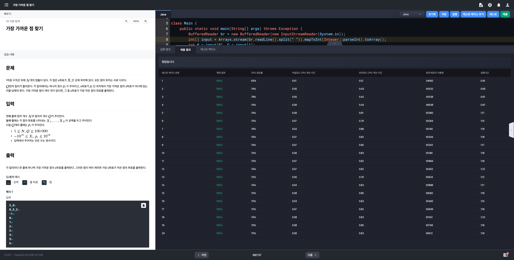

# 알고리즘 미션 - 이분 탐색

---

## 방 탈출하기

### 태그

이분 탐색

### 풀이

- **입력**

  - [Line] 1: 수열 $A$의 길이 $N$

  - [Line] 2: 수열 $A$의 요소 ($N$개의 정수)

  - [Line] 3: 모니터에 출력되는 수의 개수 $M$

  - [Line] 4 ~ [Line] 4 + M: 모니터에 출력되는 수 $B$

  - 제약 조건
    - 입력으로 주어지는 모든 수는 **정수**

    - $1 \le N,~M \le 200,000$

    - $-10^{9} \le A_{i},~B_{i} \le 10^{9}$

- **출력**

  - `1` 또는 `0`

- **문제 분석**

  - 입력으로 주어진 수열 A에 B가 포함되었는지를 확인하여

    - 포함된다면 `1`
    - 그렇지 않다면 `0`

    을 출력해야 한다.

  - 배열에 존재하는 요소를 탐색하기 위해서는 이전 챕터에서 처럼 완전탐색을 수행하거나 이분탐색을 수행하면 된다.

  - 이분 탐색(이진 탐색)의 필요조건

    - 배열이 오름차순 또는 내림차순으로 정렬되어 있어야 한다 -> 입력으로 받은 배열을 정렬할 필요가 있다.

  - 이분 탐색은 반복문 또는 재귀를 사용하여 직접 구현하거나 `Arrays.binarySearch()` 메서드를 사용하여 수행할 수 있다.


### 소스코드

```java
import java.io.*;
import java.util.Arrays;

class Main {

	public static void main(String[] args) throws Exception {
        BufferedReader br = new BufferedReader(new InputStreamReader(System.in));
        int N = Integer.parseInt(br.readLine());
        int[] A = Arrays.stream(br.readLine().split(" ")).mapToInt(Integer::parseInt).toArray();
        int M = Integer.parseInt(br.readLine());
        int mid = M / 2;

        Arrays.sort(A);

				StringBuilder sb = new StringBuilder();
        while (M > 0) {
            int B = Integer.parseInt(br.readLine());
            if (search(A, B, 0, A.length - 1)) {
                sb.append(1).append("\n");
                M--;
                continue;
            }
            sb.append(0).append("\n");
            M--;
        }

				System.out.println(sb);
    }

    private static boolean search(int[] A, int B, int start, int end) {
        if (start > end) return false;
        int mid = (start + end) / 2;
        if (B < A[mid]) return search(A, B, start, mid - 1);
        if (B > A[mid]) return search(A, B, mid + 1, end);

				return true;
    }
}
```

### 실행결과


---

## 섭외하기 대작전

### 태그

이분 탐색

### 풀이

- 입력
  - [Line] 1: 섭외 가능한 가수들의 수 $N$
  - [Line] 2: 공백으로 구분되는 각 가수의 팬클럽 영향력 $S$ (N개)
  - 제약 조건
    - 입력으로 주어지는 모든 수는 **정수**
    - $3 \le N \le 3,000$
    - $1 \le S_{i} \le 10^{12}$

- 출력
  - 조건에 맞게 섭외할 수 있는 경우의 수

- 문제 분석
  - 총 3명의 가수가 섭외된다.
  - 한 가수의 팬클럽의 영향력이 다른 두 가수의 팬클럽의 영향력의 합을 초과하는 경우가 없도록 섭외해야 한다.
  - 모든 경우를 일일히 확인할 경우 시간복잡도는 $O(N^{3})$이다.
    - N은 최대 3,000 까지 입력되므로 제한 시간안에 완전 탐색으로 이 문제를 해결하는 것은 불가능하다.
    - 따라서 이 문제를 해결하기 위해서는 이진 탐색을 사용해야 한다는 것을 알 수 있다.


### 소스코드

```java
import java.io.*;
import java.util.*;

public class Main {
    public static void main(String[] args) throws Exception {
        BufferedReader br = new BufferedReader(new InputStreamReader(System.in));
        int N = Integer.parseInt(br.readLine());
        long[] S = Arrays.stream(br.readLine().split(" "))
                .mapToLong(Long::parseLong)
                .sorted()
                .toArray();

        long result = 0L;
        for (int i = 0; i < N - 2; i++) {
            for (int j = i + 1; j < N - 1; j++) {
                long sum = S[i] + S[j];
                int idx = Arrays.binarySearch(S, j + 1, N, sum);

                // Arrays.binarySearch 메서드는 key로 주어진 값이 배열에 존재하지 않을 경우
                // (해당 값이 들어가야 하는 위치의 인덱스 * -1) - 1 을 반환한다.
                // 따라서 해당값에 -1을 곱해 양수로 변환해준 뒤 1을 빼면 가장 큰 수의 인덱스를 구할 수 있다.
                if (idx < 0) idx = -idx - 1;
                else idx++;

                if (idx > j + 1) result += (idx - (j + 1));
            }
        }

        System.out.println(result);
    }
}
```

### 실행결과


---

## 게임 마스터

### 태그

이분 탐색

### 풀이

- 입력
  - [Line] 1: 구름이가 현재까지 게임을 진행한 횟수 $N$ 과 승리한 횟수 $M$
  - 제약 조건
    - 입력으로 주어지는 모든 수는 **정수**
    - $1 \le N \le 10^{12}$
    - $0 \le M \le N$

- 출력
  - 구름이가 승률 1%를 올리기 위해 필요한 승수
  - 만약 최소 게임 횟수가 $10^{12}~(1조)$회 이상이라면 `x`를 출력한다.

- 문제 분석
  - 구름이는 현재 승률에서 `1%`만 승률을 더 올리면 마스터 칭호를 얻을 수 있다.
  - 게임에서의 승률: $M \div N * 100$
  - 게임 내에서 승률은 소수부를 내림한 정수부만 표기된다. (e.g. `58.893%` -> `58%`)
  - 해결법
    - 구름이가 추가로 게임을 할 수 있는 횟수는 $1$회 이상 $10^{12}$회 미만이다.
    - 따라서, 해당 구간 내에서 이분 탐색을 수행하여 값을 구해야 한다.


### 소스코드

```java
import java.io.BufferedReader;
import java.io.InputStreamReader;
import java.util.Arrays;

class Main {
    public static void main(String[] args) throws Exception {
        BufferedReader br = new BufferedReader(new InputStreamReader(System.in));
        long[] input = Arrays.stream(br.readLine().split(" ")).mapToLong(Long::parseLong).toArray();
        long N = input[0], M = input[1];

        long currentRate = M * 100 / N, winningRate = currentRate + 1;

        long from = 1L, to = 999_999_999_999L;
        long criteria = 1_000_000_000_000L;

        while (from <= to) {
            long mid = (from + to) / 2;
            long rate = (M + mid) * 100 / (N + mid);

            if (rate >= winningRate) {
                criteria = mid;
                to = mid - 1;
            } else {
                from = mid + 1;
            }
        }

        if (criteria == 1_000_000_000_000L) System.out.println("X");
        else System.out.println(criteria);
    }
}
```

### 실행결과


---

## 가장 가까운 점 찾기

### 태그

이분 탐색

### 풀이

- 입력
  - [Line] 1: 점의 개수 $N$과 질의의 개수 $Q$
  - [Line] 2: 각 점의 좌표를 나타내는 $X_{1},...,X_{N}$
  - [Line] 3 ~ 3 + Q: 질의 $p_{i}$
  - 제약 조건
    - 입력으로 주어지는 모든 수는 **정수**
    - $1 \le N,Q \le 100,000$
    - $-10^{18} \le X_{i},p_{i} \le 10^{18}$

- 출력
  - 각 질의마다 한 줄에 하나씩 가장 가까운 점의 x좌표를 출력
  - 그러한 점이 여러 개라면 (질의의 좌표에서의 거리가 동일한 점이 여러개)

- 문제 분석
  - 이전 문제와 마찬가지로 정렬된 배열 내에서 이분 탐색을 통해 조건과 일치하는 값을 찾으면 된다.


### 소스코드

```java
import java.io.BufferedReader;
import java.io.InputStreamReader;
import java.util.Arrays;

class Main {
    public static void main(String[] args) throws Exception {
        BufferedReader br = new BufferedReader(new InputStreamReader(System.in));
        int[] input = Arrays.stream(br.readLine().split(" ")).mapToInt(Integer::parseInt).toArray();
        int N = input[0], Q = input[1];

        long[] X = Arrays.stream(br.readLine().split(" ")).mapToLong(Long::parseLong).toArray();
        Arrays.sort(X);

        StringBuilder sb = new StringBuilder();
        while (Q > 0) {
            long p = Long.parseLong(br.readLine());

            int start = 0, end = N - 1;
            while (start < end) {
                int mid = (start + end) / 2;

              	// 인덱스 mid의 좌표가 p의 좌표보다 작다면 조건 만족 X
                if (X[mid] < p) start = mid + 1;
              	// 인덱스 mid의 값이 p의 좌표보다 크거나 같다면 조건을 만족
              	// 인덱스 mid 이후의 요소들은 고려할 필요 X -> end를 mid로 설정
                else end = mid;
            }

            // start == 0은 p보다 좌표값이 작은 점이 없다는 뜻이므로 X의 첫번째 요소가 가장 가까운 점이 된다.
            if (start == 0) sb.append(X[start]).append("\n");
            else {
                // p의 좌표와 같거나 p보다 큰 좌표를 가지는 점 중에서 p에 더 가까운 점을 찾아 출력한다.
                if (Math.abs(p - X[start - 1]) <= Math.abs(p - X[start])) sb.append(X[start - 1]).append("\n");
                else sb.append(X[start]).append("\n");
            }
            Q--;
        }

        System.out.println(sb);
    }
}
```

### 실행결과



