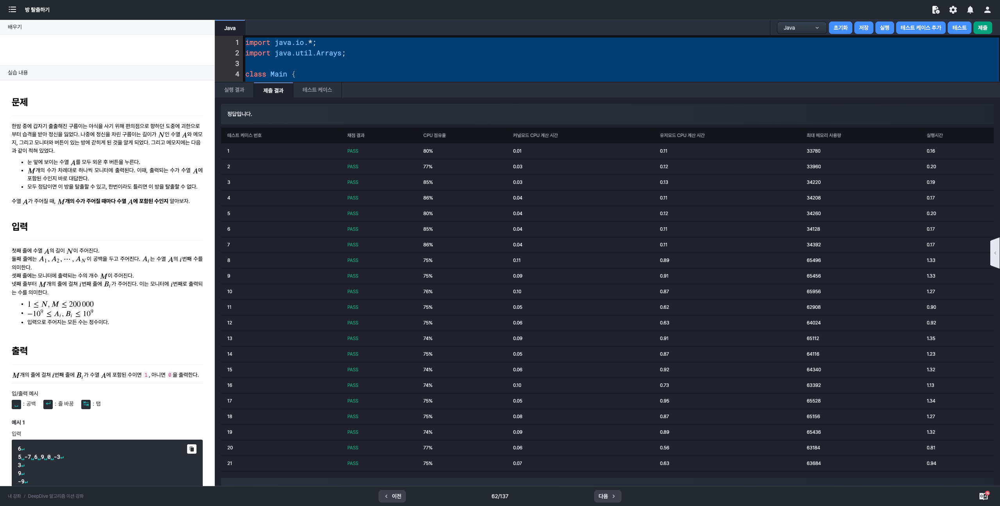

# 알고리즘 미션 - 이분 탐색

---

## 방 탈출하기

### 태그

이분 탐색

### 풀이

- **입력**

  - [Line] 1: 수열 $A$의 길이 $N$

  - [Line] 2: 수열 $A$의 요소 ($N$개의 정수)

  - [Line] 3: 모니터에 출력되는 수의 개수 $M$

  - [Line] 4 ~ [Line] 4 + M: 모니터에 출력되는 수 $B$

  - 제약 조건
    - 입력으로 주어지는 모든 수는 **정수**

    - $1 \le N,~M \le 200,000$

    - $-10^{9} \le A_{i},~B_{i} \le 10^{9}$

- **출력**

  - `1` 또는 `0`

- **문제 분석**

  - 입력으로 주어진 수열 A에 B가 포함되었는지를 확인하여

    - 포함된다면 `1`
    - 그렇지 않다면 `0`

    을 출력해야 한다.

  - 배열에 존재하는 요소를 탐색하기 위해서는 이전 챕터에서 처럼 완전탐색을 수행하거나 이분탐색을 수행하면 된다.

  - 이분 탐색(이진 탐색)의 필요조건

    - 배열이 오름차순 또는 내림차순으로 정렬되어 있어야 한다 -> 입력으로 받은 배열을 정렬할 필요가 있다.

  - 이분 탐색은 반복문 또는 재귀를 사용하여 직접 구현하거나 `Arrays.binarySearch()` 메서드를 사용하여 수행할 수 있다.


### 소스코드

```java
import java.io.*;
import java.util.Arrays;

class Main {

	public static void main(String[] args) throws Exception {
        BufferedReader br = new BufferedReader(new InputStreamReader(System.in));
        int N = Integer.parseInt(br.readLine());
        int[] A = Arrays.stream(br.readLine().split(" ")).mapToInt(Integer::parseInt).toArray();
        int M = Integer.parseInt(br.readLine());
        int mid = M / 2;

        Arrays.sort(A);

				StringBuilder sb = new StringBuilder();
        while (M > 0) {
            int B = Integer.parseInt(br.readLine());
            if (search(A, B, 0, A.length - 1)) {
                sb.append(1).append("\n");
                M--;
                continue;
            }
            sb.append(0).append("\n");
            M--;
        }

				System.out.println(sb);
    }

    private static boolean search(int[] A, int B, int start, int end) {
        if (start > end) return false;
        int mid = (start + end) / 2;
        if (B < A[mid]) return search(A, B, start, mid - 1);
        if (B > A[mid]) return search(A, B, mid + 1, end);

				return true;
    }
}
```

### 실행결과



---

## 섭외하기 대작전

### 태그

이분 탐색

### 풀이

- 입력
  - [Line] 1: 섭외 가능한 가수들의 수 $N$
  - [Line] 2: 공백으로 구분되는 각 가수의 팬클럽 영향력 $S$ (N개)
  - 제약 조건
    - 입력으로 주어지는 모든 수는 **정수**
    - $3 \le N \le 3,000$
    - $1 \le S_{i} \le 10^{12}$

- 출력
  - 조건에 맞게 섭외할 수 있는 경우의 수

- 문제 분석
  - 총 3명의 가수가 섭외된다.
  - 한 가수의 팬클럽의 영향력이 다른 두 가수의 팬클럽의 영향력의 합을 초과하는 경우가 없도록 섭외해야 한다.
  - 모든 경우를 일일히 확인할 경우 시간복잡도는 $O(N^{3})$이다.
    - N은 최대 3,000 까지 입력되므로 제한 시간안에 완전 탐색으로 이 문제를 해결하는 것은 불가능하다.
    - 따라서 이 문제를 해결하기 위해서는 이진 탐색을 사용해야 한다는 것을 알 수 있다.


### 소스코드

```java
import java.io.*;
import java.util.*;

public class Main {
    public static void main(String[] args) throws Exception {
        BufferedReader br = new BufferedReader(new InputStreamReader(System.in));
        int N = Integer.parseInt(br.readLine());
        long[] S = Arrays.stream(br.readLine().split(" "))
                .mapToLong(Long::parseLong)
                .sorted()
                .toArray();

        long result = 0L;
        for (int i = 0; i < N - 2; i++) {
            for (int j = i + 1; j < N - 1; j++) {
                long sum = S[i] + S[j];
                int idx = Arrays.binarySearch(S, j + 1, N, sum);

                // Arrays.binarySearch 메서드는 key로 주어진 값이 배열에 존재하지 않을 경우
                // (해당 값이 들어가야 하는 위치의 인덱스 * -1) - 1 을 반환한다.
                // 따라서 해당값에 -1을 곱해 양수로 변환해준 뒤 1을 빼면 가장 큰 수의 인덱스를 구할 수 있다.
                if (idx < 0) idx = -idx - 1;
                else idx++;

                if (idx > j + 1) result += (idx - (j + 1));
            }
        }

        System.out.println(result);
    }
}
```

### 실행결과


---

## 게임 마스터

### 태그

이분 탐색

### 풀이

- 입력
- 출력
- 문제 분석

### 소스코드

```java

```

### 실행결과


---

## 가장 가까운 점 찾기

### 태그

이분 탐색

### 풀이

- 입력
- 출력
- 문제 분석

### 소스코드

```java

```

### 실행결과

