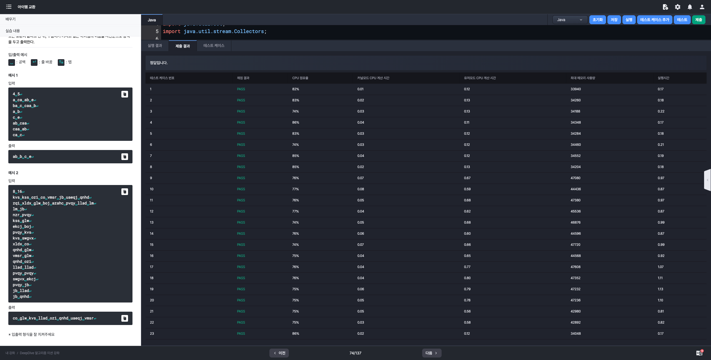

# 알고리즘 미션 - 자료구조

---

## 뒤통수가 따가워

### 태그

자료구조, 스택

### 풀이

- **입력**
  - [Line] 1: 봉우리의 수 $N$

  - [Line] 2: N개의 봉우리의 높이 $h_{1}, \cdots , h_{N}$ (공백을 기준으로 구분)

  - 제약 조건
    - $5 \le N \le 100,000$

    - $1 \le h_{i} \le 10^{9}$
- **출력**
  - 해당 봉우리에 있는 신선의 뒤통수를 볼 수 있는 다른 신선의 수를, 가장 서쪽의 봉우리에 있는 신선부터 순서대로 출력 (공백을 기준으로 구분)
- **문제 분석**
  - 무릉도원의 높은 산맥에는 왼쪽에서 오른쪽으로 일렬로 위치한 높은 산봉우리들이 존재
  - 모든 산봉우리에는 동쪽을 바라보며 명상을 하는 신선이 한 명씩 존재
  - 좌측을 기준으로 a번째 봉우리의 신선이 b번째 봉우리에 있는 신선의 뒤통수를 보려면
    - $a < b$ 이면서
    - 두 봉우리 사이에 있는 모든 봉우리의 높이가 a번째 봉우리의 높이보다 낮아야 한다.


### 소스코드

```java
import java.io.BufferedReader;
import java.io.InputStreamReader;
import java.util.Arrays;
import java.util.Deque;
import java.util.ArrayDeque;

class Main {
    public static void main(String[] args) throws Exception {
        BufferedReader br = new BufferedReader(new InputStreamReader(System.in));
        int N = Integer.parseInt(br.readLine());
        int[] h = Arrays.stream(br.readLine().split(" ")).mapToInt(Integer::parseInt).toArray();

        Deque<Integer> stack = new ArrayDeque<>();
        StringBuilder sb = new StringBuilder();
        for (int i = 0; i < N; i++) {
            sb.append(stack.size()).append(" ");
            while (!stack.isEmpty() && h[stack.peek()] <= h[i]) stack.pop();
            stack.push(i);
        }
        System.out.println(sb.toString().trim());
    }
}
```

### 실행결과


---

## 재고 정리

### 태그

자료구조, 맵

### 풀이

- **입력**

  - [Line] 1: 구름이가 기록한 정보의 개수 $N$

  - [Line] 2 ~ 2 + N: 음식의 종류 $S_{i}$ 와 개수 $A_{i}$

  - 제약 조건
    - 입력으로 주어지는 수는 모두 정수
    - $1 \le N \le 200,000$
    - $1 \le A_{i} \le 100$
    - $S_{i}$는 알파벳 소문자로 이루어진 길이 20 이하의 문자열

- **출력**

  - 재고를 정리한 결과를 출력

- **문제 분석**

  - 탕비실에는 여러 음식이 보관되어 있다.
  - 재고 정리는 다음과 같은 규칙하에 이루어진다.
    1. 같은 종류의 음식이 여러 번 기록되었다면, 그 개수를 모두 **합쳐서** 하나의 정보로 만든다. 이름이 같고 종류가 다른 음식은 존재하지 않는다.
    2. 재고 현황을 음식의 종류를 기준으로 하여 **사전순으로 오름차순** 정렬한다.

  - 입력 데이터가 key, value 쌍으로 주어지므로 Map을 사용하면 된다.


### 소스코드

```java
import java.io.BufferedReader;
import java.io.InputStreamReader;
import java.util.Map;
import java.util.TreeMap;

class Main {
    public static void main(String[] args) throws Exception {
        BufferedReader br = new BufferedReader(new InputStreamReader(System.in));
        int N = Integer.parseInt(br.readLine());

        Map<String, Integer> map = new TreeMap<>();
        for (int i = 0; i < N; i++) {
            String[] input = br.readLine().split(" ");
            String name = input[0];
            int amount = Integer.parseInt(input[1]);

            if (map.containsKey(name)) map.replace(name, map.get(name) + amount);
            else map.put(name, amount);
        }

        StringBuilder sb = new StringBuilder();
        map.forEach((key, value) -> sb.append(key).append(" ").append(value).append("\n"));

        System.out.println(sb);
    }
}
```

### 실행결과


---

## 아이템 교환

### 태그

자료구조, 셋

### 풀이

- **입력**
  - [Line] 1: 구름이와 친구가 가지고 있는 아이템의 수 $N$, 교환을 시도한 횟수 $M$

  - [Line] 2: 구름이가 처음에 가지고 있던 $N$ 종류의 아이템 이름

  - [Line] 3: 친구가 처음에 가지고 있던 $N$ 종류의 아이템 이름

  - [Line] 4 ~ 4 + M: 두 문자열 $A_{i}$ 와 $B_{i}$

  - 제약 조건
    - $1 \le N \le 5,000$

    - $1 \le M \le 200,000$

    - 아이템 이름은 알파벳 소문자로만 이루어진 길이 1 이상 5 이하의 문자열

    - 아이템의 이름은 모두 다르다. (중복 X)

- **출력**
  - 모든 교환이 끝난 뒤 구름이가 가지고 있는 아이템의 이름을 사전순으로 공백을 두고 출력

- **문제 분석**
  - 구름이와 친구는 각각 $N$개의 서로 다른 아이템을 가지고 있다.
  - 구름이와 친구는 $M$번의 교환 과정을 통해 서로 아이템을 교환한다.
  - 교환조건: 구름이가 $A_{i}$ 아이템을 가지고 있고 친구가 $B_{i}$ 아이템을 가지고 있다면 교환이 이루어진다.
  - 구름이와 친구는 중복되지 않는 유니크한 아이템을 가지고 있어야 하므로 Set을 사용하면 된다.


### 소스코드

```java
import java.io.BufferedReader;
import java.io.InputStreamReader;
import java.util.Arrays;
import java.util.Set;
import java.util.stream.Collectors;

class Main {
    public static void main(String[] args) throws Exception {
        BufferedReader br = new BufferedReader(new InputStreamReader(System.in));
        int[] input = Arrays.stream(br.readLine().split(" ")).mapToInt(Integer::parseInt).toArray();
        int N = input[0];
        int M = input[1];
        Set<String> goormItems = Arrays.stream(br.readLine().split(" ")).collect(Collectors.toSet());
        Set<String> friendItems = Arrays.stream(br.readLine().split(" ")).collect(Collectors.toSet());

        while (M-- > 0) {
            String[] exchange = br.readLine().split(" ");
            if (goormItems.contains(exchange[0]) && friendItems.contains(exchange[1])) {
                goormItems.remove(exchange[0]);
                friendItems.remove(exchange[1]);
                goormItems.add(exchange[1]);
                friendItems.add(exchange[0]);
            }
        }

        StringBuilder sb = new StringBuilder();
        goormItems.stream().sorted().forEach(item -> sb.append(item).append(" "));
        System.out.println(sb.toString().trim());
    }
}
```

### 실행결과



---

## 묶음 상품

### 태그


### 풀이

- **입력**
  
- **출력**
  
- **문제 분석**


### 소스코드

```java

```

### 실행결과

